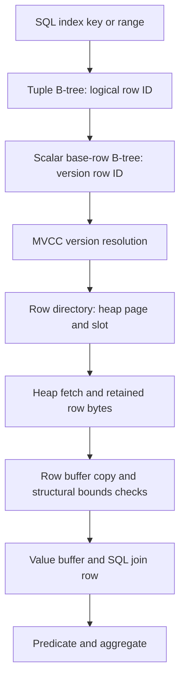

# Reduce work in River's indexed-read path

Date: 2026-09-28. Status: diagnosis and recommended design direction; no storage
redesign is implemented or accepted by this document.

River's current indexed-read path searches a SQL tuple index for a logical row
identity, searches another tree for that row's version, locates a heap record,
copies the record and publishes values before evaluating the query. It repeats
much of this for every input to a join, even when the query needs only a few
numeric columns. Correct join ordering reduces the number of candidates but
does not remove this work per candidate.

The recommendation is to make indexed access return the required visible values
with one key search and propagate column requirements into storage. Repeated
semantic validation of trusted content was removed by
[tic-elvenking](../tickets/tic-elvenking.md); that change did not remove the
extra index search or full base-row fetch. A clustered primary index is a
serious replacement candidate, not excluded because it changes durable formats.
There is no backward-compatibility requirement: the selected implementation
must replace its superseded path, formats and tests completely.

## Source and evidence boundary

The original diagnosis inspected accepted production code `f77bb51a`; its
later evidence-only commit is `a8c50237681e790eeefbcef9bfa8e185e0b2f83d`.
The drafting checkout was the older investigation snapshot `dd8baefb`.
Code links below locate the relevant owners. The trusted-value delivery was
integrated at `75039adc`; its
[completion review](../delivery/evidence/2026-09-28-tic-elvenking-completion-review.md)
records the checks removed and the remaining indexed-read work.
The current [performance history](../performance-checkpoints.md) and
[Stock Level ticket](../tickets/tic-72e5.md) contain later evidence.

The full profile has 100,000 stock rows and about 300,000 order-line rows per
warehouse. Measurements used one worker/warehouse, seed 42, retry limit 3,
READ COMMITTED, durable local WAL and GraalVM 25.0.4 JVM `-Xmx1g` on macOS/arm64.
River used TCP/TLS; MariaDB used a Unix socket. These are engineering workload
diagnostics, not audited TPC-C or an isolated storage-engine comparison.

| Evidence | Observation | What it establishes |
| --- | --- | --- |
| Costed join order, `34ee0800` | Full-profile mean increased from 23.732 to 1,135.756 commits/s. | The earlier full-data join-order problem was real and is already addressed. |
| Cached tuple-root records, `b17e0450` | Adjacent long-run means were 939.516 control and 1,204.348 candidate commits/s. | Repeated index-root metadata retrieval was material; root caching is already accepted. |
| Omit unused text publication, `9fcd3007` | Adjacent means were 1,205.110 and 1,247.589 commits/s. | Avoiding some text work helped, but did not eliminate full-row access. Content validation was removed later. |
| Latest accepted River baseline versus later MariaDB diagnostic | 1,234.227 versus 4,671.164 commits/s. | Roughly a 3.8-fold remaining target gap; the runs were not interleaved. |
| Sampled join timing on accepted code | About 633 microseconds per aggregate execution, 615 in row production and 13 in aggregation. | Concentrate on producing join rows, rather than the final count operation. |

The last cross-target artifacts are
`river_harness_20260928_111715_048cab5f` and
`river_harness_20260928_121525_6944a942`, under
`/private/tmp/river-harness-stock-analyze/runs/`. Both passed invariants and
cleanup, had zero failures/unknown commits/retries and shared eligible key
`1233ecf3b5d1481602a7daaef90e8d09db95fa8853cd6657579ce827583e835f`.
Their matching metadata does not make them an interleaved experiment. Physical
index shapes were manually matched earlier; automatic parity enforcement is
still absent. The reduced `sample` profile already exceeded MariaDB in the
recorded one-request comparison and must not be conflated with `full`.

Temporary sampling reports are `/private/tmp/river-stock-latest-timing.txt`,
`/private/tmp/river-stock-storage-open-timing.txt` and
`/private/tmp/river-stock-join-timing.txt`. They include warmup and instrumented
execution; they are not measured-window CPU accounting. They observed roughly
225 stock opens per count query, about 0.90 microseconds per stock index open,
0.36 per base-row fetch and 0.16 per decode. These separately sampled and partly
nested observations must not be summed into a claimed percentage of the gap.

## What the query actually requires

Stock Level reads the next order ID, visits the last 20 orders in one district,
finds their item IDs, tests each associated stock quantity against a threshold,
and counts distinct qualifying items. Its count query references these columns:

| Table | Required values |
| --- | --- |
| `order_line` | `ol_w_id`, `ol_d_id`, `ol_o_id`, `ol_i_id` |
| `stock` | `s_w_id`, `s_i_id`, `s_quantity` |

The query does not need stock distribution strings, stock descriptive text,
order-line descriptive text, or stock accounting counters. The stock row has
17 columns, including 11 text columns. A scan's key can establish some predicates
without materializing those values again, provided its visibility contract
proves that the index entry and selected row version agree.

## The current execution path

This is the ordinary committed indexed-row path. Pending mutations and older
visible versions require their own handling within the same semantic owner.
These stages are CPU and memory work even when all pages are cached; they do
not imply a disk read per stage.

| Current owner | Work performed |
| --- | --- |
| [SqlUniversalDescriptorRoleScan](../../river-engine/src/main/java/io/riverdb/engine/sql/SqlUniversalDescriptorRoleScan.java) | Opens a general index cursor for each nested-loop inner probe. |
| [RelationalDescriptorScanAccess](../../river-engine/src/main/java/io/riverdb/engine/relational/RelationalDescriptorScanAccess.java) | Obtains a logical row ID, fetches the base row and rechecks tuple bounds against decoded values. |
| [RelationalDescriptorRowAccess](../../river-engine/src/main/java/io/riverdb/engine/relational/RelationalDescriptorRowAccess.java) | Calls `fetchByKey(baseRows(tableId), logicalRowId)`. |
| [IndexedKernelVisibility](../../river-engine/src/main/java/io/riverdb/engine/table/IndexedKernelVisibility.java) | Searches the separate scalar B-tree, resolves MVCC visibility, then fetches the visible row. |
| [IndexedKernelRowAccess](../../river-engine/src/main/java/io/riverdb/engine/table/IndexedKernelRowAccess.java) | Resolves a physical version's heap location and retains row bytes before releasing the page. |
| [RelationalDescriptorRowBuffer](../../river-engine/src/main/java/io/riverdb/engine/relational/RelationalDescriptorRowBuffer.java) | Copies the retained row into another buffer before decoding. |
| [StoredTableRowDecoder](../../river-engine/src/main/java/io/riverdb/engine/relational/StoredTableRowDecoder.java) | Checks identity and required structural bounds, then publishes trusted values; numeric-only access omits text metadata. |
| [SqlUniversalDescriptorJoinRow](../../river-engine/src/main/java/io/riverdb/engine/sql/SqlUniversalDescriptorJoinRow.java) | Copies published values into the SQL join-row representation. |

The SQL primary index is therefore not the row store. Its leaf provides a
logical row identity, not the requested row values or a directly usable visible
version. The physical-version-to-heap directory already exists, but it cannot
replace the logical-row-to-current-version lookup by treating the two IDs as
interchangeable.

For N order-line candidates with N matching stock probes, this design performs
approximately 2N additional scalar base-tree searches: N for order lines and N
for stock. At N = 200, that is approximately 400 extra root-to-leaf searches,
in addition to the outer tuple-index range scan and inner tuple-index probes.
This is a structural count for the stated path, not a new measured event total;
missing keys, pending writes and alternative plans change the count.

InnoDB clusters table data in the primary index, which avoids this separate
base-row-tree lookup for a primary-key read. That is a concrete structural
difference, not proof that copying its entire design yields a particular gain.
See [MariaDB's primary-index explanation](https://mariadb.com/docs/server/ha-and-performance/optimization-and-tuning/optimization-and-indexes/building-the-best-index-for-a-given-select).

## Why smaller changes have not resolved the gap

The point-fetch experiment still traversed the tuple index and fetched the base
row, so replacing the cursor API did not remove the two-tree access path. It
showed no repeatable gain. Removing the second whole-row copy likewise left
searches and full decoding intact; candidate/control means were both about
1,186 commits/s. Ending a unique cursor after one candidate and resetting only
active join stages also produced no accepted gain.

These results constrain the recommendation: changing wrappers, loop bounds or
one copy is not enough evidence to accept another optimization. They do not
prove that all copies, decoding or cursor work are free. The next substantial
change should remove a measurable class of work, with a countable mechanism.

## Recommended changes

### 1. Trust stored content and internal typed values — delivered

The first independent change was delivered in
[tic-elvenking](../tickets/tic-elvenking.md). Validate external input and new
semantic results at their owning boundary. Do not repeatedly scan River-written
text, unchanged numeric values
or canonical padding during normal reads and updates. Keep lightweight bounds,
identity, generation, visibility and lifetime checks where required.

Updating `s_quantity` no longer decodes and re-encodes unchanged stock strings
through UTF-16; [SqlDescriptorMutationValues](../../river-engine/src/main/java/io/riverdb/engine/sql/SqlDescriptorMutationValues.java)
copies trusted typed bytes directly, checking newly assigned or
converted values against their actual target constraints. This is broader than
skipping text in Stock Level and benefits read-modify-write workloads as well.

Deep content validation belongs in explicit, independently invoked integrity
utilities outside critical paths. Those utilities are deferred: do not implement
them, add background scanning, or move the same scans into startup/recovery as
a prerequisite. This intentionally reduces automatic content-damage detection.

### 2. Carry column requirements to a storage-owned projected read

Bind one required-column set from projection, predicates, joins and any necessary
index-version recheck. Pass it to the canonical row access owner. Decode fixed
values directly from their stored offsets and touch variable-length values only
when the query or a required semantic operation uses them. Avoid publishing
unreferenced numeric columns as well as text.

Return a reusable projected result or a bounded borrowed view from that owner;
do not add a parallel Stock Level executor. A borrowed view is valid only while
its visible version and page are pinned. If the result outlives that pin, copy
only the required values into caller-owned storage. Closing, cancellation,
failure and buffer reuse must release ownership exactly once. Zero-copy does
not justify retaining an unpinned page or confusing latest and visible versions.

Projection alone does not remove the second tree search. A successful projected
read should demonstrate reduced bytes copied and columns decoded; it must not
be credited with structural search reduction that it has not implemented.

### 3. Replace the extra logical-row tree lookup

The preferred architectural candidate is a **clustered primary row store**:
primary-key leaf access reaches row data and the metadata needed to resolve its
visible version. An order-line primary range then reads adjacent row records;
a stock primary probe reaches quantity through the same key search. Secondary
indexes retain one defined reference scheme into this primary store. Avoid
duplicating live row values across a primary tree, scalar base tree and heap.

This is a substantial replacement spanning primary storage, row/version
identity, secondary-index references, mutations, vacuum, WAL and recovery. It
needs a durable decision and independent storage/concurrency review before
implementation. Measure the consequences for wide-row page fanout, splits,
primary-key updates, write amplification, history retention and secondary-index
lookup cost. Overflow handling must follow structural or configured limits,
not a workload-specific row-size cap.

A credible alternative is to retain heap storage but replace the scalar
logical-row mapping with a **paged, directly addressed logical-row head
directory**. Tuple indexes yield a logical ID; the directory locates its version
head without a B-tree key search; the existing visibility owner resolves the
right version and heap location. This requires an explicit mapping and durable
publication contract. The existing directory addresses physical version IDs,
so it is not already this facility. Bound its cache by the runtime budget,
preserve long addressability, and define exhaustion/backpressure and recovery.

Prototype and measure these as alternatives, then select one canonical owner.
Do not ship both layouts behind feature flags, retain the scalar base tree as a
permanent fallback, or keep duplicate mutation/recovery paths for migration.
The preferred clustered design may be rejected if its measured write/storage
costs outweigh its read benefit; the direct directory is an architectural
alternative, not an excuse to retain two equivalent mappings.

### 4. Consider generic covering payloads only with their full cost

Index payloads can supply required non-key values without fetching a base row.
They are useful for general covering access, but adding `s_quantity` or
`ol_i_id` solely to the benchmark schema would change the comparison rather
than fix River's existing execution contract.

If generic payload support is selected, define how payload versions agree with
the transaction snapshot and pending writes, how updates maintain them, and
how WAL/recovery restores index and row consistency. Storing a mutable quantity
in an index increases maintenance cost for New Order. Measure that cost before
accepting a read improvement. A raw heap pointer or copied payload cannot
bypass MVCC, deletion or generation checks.

## Delivery and validation

The validation change was delivered separately from the selected durable storage
replacement. Each accepted slice replaces its own superseded
mechanism completely. A durable replacement must change all production callers,
write paths, format readers and recovery together; staged delivery is not
permission to leave a second permanent engine. No legacy-format decoder,
migration adapter or compatibility flag is required.

Before changing production code, use the latest pushed stable checkpoint and
capture the unchanged workload's searches, visited pages, copied bytes,
decoded columns, allocations, CPU/transaction, latency and throughput where
the proposed mechanism needs them. Use temporary counters or existing profiling;
do not construct a new telemetry framework. A search-count reduction and a TPS
improvement are separate evidence requirements.

Verify current and older snapshot reads, READ COMMITTED statement refresh,
read-your-writes, pending insert/update/delete, key changes, rollback, deletes,
secondary indexes, serializable protection, cancellation and page lifetime.
For a durable replacement, add split, vacuum/reclamation, checkpoint, replay,
crash and resource-pressure evidence appropriate to the changed invariants.
Storage trust removes repeated semantic content inspection; it does not remove
the correctness work required to recover committed transactions after a crash.

Use focused tests while editing, affected-module checks and the required clean
feature checkpoint before acceptance. Re-run matched `full stock-level` samples
and an adjacent `sample stock-level` control; measure an affected update workload
such as New Order so reduced read cost does not conceal higher write cost. Keep
schema/SQL, physical index inventory, seed, isolation, durability, runtime,
workers and warehouse count fixed. Serialize host workloads and retain all
outcomes and cleanup evidence. Broader matrices require a specific unresolved
question, not this document alone.

For a cross-database claim, use longer interleaved samples, matching eligible
comparison keys and actual index inventories, and acknowledge transport
differences. Keep the harness and comparison utility outside River. Rejected
or inconclusive prototypes are removed, with their evidence retained. No
individual proposal here is a promise to recover the entire remaining gap.
