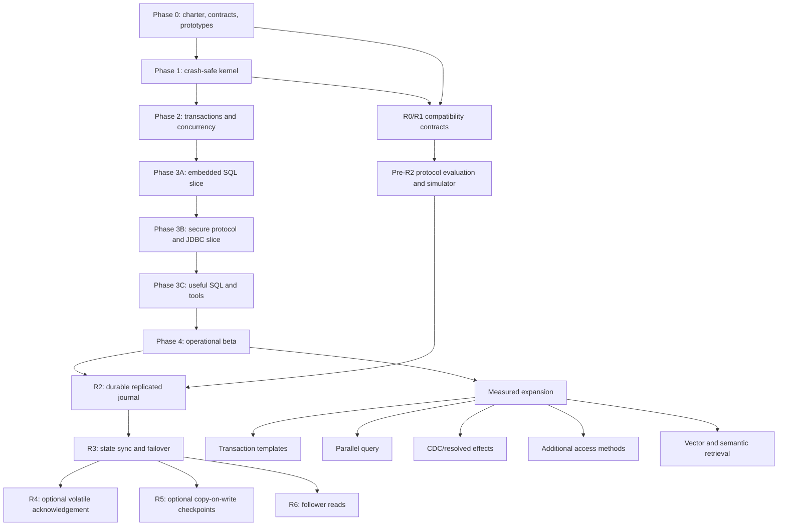

# River Project Implementation and Dependency Plan

<!-- markdownlint-disable MD013 -->

Status: Proposed execution plan derived from the reviewed architecture

Audience: River contributors, lead integrators, reviewers, and project owners

Related plans:

- [River High-Level Architecture and Delivery Plan](river-high-level-plan.md)
- [River Engineering Personas and Performance Charter](river-engineering-personas-and-performance-charter.md)
- [River Indexed-Table Store Ownership Refactoring Plan](river-indexed-table-store-refactoring-plan.md)
- [River Performance Review and Benchmark Plan](river-performance-review-and-benchmark-plan.md)
- [River Replicated Journal, Durability, and Storage Evolution Plan](river-replicated-journal-durability-plan.md)
- [River and TigerBeetle: Comparative Analysis and Recommended Choices](river-tigerbeetle-comparison-and-recommendations.md)

## 1. Purpose

This document turns River's architecture into an implementation program. It
defines:

- the key deliverables and their dependencies;
- which work may proceed in parallel and under which contract;
- the critical path to a crash-safe kernel, embedded SQL, secure JDBC, and an
  operational beta;
- the separate but connected path to replicated durability and failover;
- the integration and evidence gates that prevent incomplete subsystems from
  being mistaken for progress.

This is an ordering plan, not a calendar estimate. Team size, benchmark results,
and review findings determine elapsed time. A deliverable is complete only when
its useful behavior works and the proportionate tests and checks for that
behavior pass. Documentation, diagnostics, evidence, or review without a
concrete production consumer does not complete a deliverable.

### 1.1 Value-first execution rule

Useful kernel function is the priority. Work is selected by the shortest
dependency path to a recoverable storage kernel, transactions, and executable
SQL—not by the opportunity to add infrastructure, observability, process, or
review artifacts.

- Every infrastructure task must name an immediate production-kernel consumer
  and the behavior it unblocks.
- No additional observability investment is authorized unless production
  kernel code directly needs it for correctness, diagnosis, or operation now.
- A module may appear in the architecture map before implementation, but it is
  not included or dependency-wired in the active Gradle build until its first
  production code arrives.
- Reviews answer a bounded question for a concrete change. A review cycle is
  not a substitute for implementing the next functional slice.
- Supporting work stops when the current consumer is unblocked. Possible
  future reuse is not a reason to broaden the task.

### 1.2 Completed priority override

K16 ran as River's immediate priority alongside the already-underway U00
decomposition, under disjoint source ownership. K16 completed on 2026-08-12;
its temporary precedence over U01-U06 and the type/temporal lane is therefore
satisfied. U00 was not paused or made dependent on K16.

## 2. Dependency language

The tables use three dependency types:

| Type | Meaning | May dependent implementation start? |
| --- | --- | --- |
| Hard (`H`) | The dependency's behavior or implementation is required. | No, except for isolated experiments that will be discarded. |
| Contract (`C`) | An accepted interface, invariant, or fixture required by a named consumer is sufficient for parallel work. | Yes, but integration cannot complete until the real implementation passes its owner-specific evidence. |
| Gate (`G`) | Independent correctness, performance, security, or operations evidence is required before promotion. | Implementation may exist, but it cannot become the supported next-layer foundation. |

Rules:

- A contract dependency is versioned and has one owner. Parallel teams do not
  invent competing versions of the same interface.
- A fake provider models failure and backpressure, not merely the happy path.
- A gate is not waived because downstream code compiles.
- Durable formats, public APIs, consensus transitions, and transaction
  visibility rules require accepted ADRs before their first compatibility
  promise.
- The lead integrator limits work in progress and owns cross-module assembly.
- Each non-kernel dependency in this plan is activated only when its named
  kernel consumer is ready to use it.

## 3. Program topology



The local product path establishes concrete WAL identity and durability behavior.
The replication path derives its journal, incarnation, idempotency, and frontier
contract from that evidence when R24 supplies the first real replicated consumer.
R2 production integration begins only after the single-node operational beta;
protocol evaluation and deterministic simulation may proceed earlier without
freezing an unused provider abstraction.

## 4. Workstreams and ownership lanes

| Lane | Primary scope | Begins | Primary persona | Must not independently redefine |
| --- | --- | --- | --- | --- |
| A: Program foundations | Minimum charter, CI, provenance, ADR, benchmark, and dependency support required by the current kernel slice | On demand from a named kernel consumer | Lead integrator | Kernel contracts owned by domain lanes |
| B: Runtime and durability | Platform I/O, formats, concrete WAL, buffer writeback, recovery mechanics | Phase 0 | Storage/recovery plus runtime/performance | Transaction visibility or SQL semantics |
| C: Storage and access | Allocation, heap, B+tree, version store, storage recovery handlers | Phase 1 | Storage/recovery | WAL force semantics or transaction outcomes |
| D: Transactions and catalog | Transaction lifecycle, MVCC, locks, rollback, vacuum, transactional catalog | Phase 1 contracts; Phase 2 implementation | Transaction/concurrency | Page formats or SQL grammar |
| E: Relational execution | SQL profile, parser, binder, planner, vectors, DML, constraints | Phase 0 contracts; integrated after Phase 2 | Relational execution | Transaction visibility or storage durability |
| F: Boundaries and security | Engine API, protocol, client, server, JDBC, TLS, auth, admission | API contracts during Phase 3A | Boundary/operations | Kernel implementation types |
| G: Operations and compatibility | Backup, restore, inspect, verify, migration, observability, packaging, upgrade | Only when the current kernel or supported product slice consumes it | Boundary/operations | Backup/recovery invariants owned by kernel |
| H: Replication | Consensus adapter, replication transport, follower apply, membership, state sync | Contract research after R1; production after Phase 4 | Replication/distributed systems | Local WAL layout or SQL decisions |

Each correctness-critical slice also names an independent correctness adversary.
Hot-path work requires the performance/allocation reviewer. SQL-visible work
requires the relational semantics reviewer. External boundaries require the
boundary/security reviewer.

## 5. Deliverable dependency register

### 5.1 Foundation and Phase 0

| ID | Deliverable | Hard dependencies | Contract or gate dependencies | Parallel notes / enables |
| --- | --- | --- | --- | --- |
| P00 | Product charter, workload, v1 scope, exclusions | None | Architecture approval (`G`) | Enables every scope-sensitive ADR. |
| P01 | License/provenance policy and legacy reference rules | None | Project-owner provenance review (`G`) | Runs with P00; approved references require explicit provenance for adapted material. |
| P02 | Engineering charter, deterministic style/static analysis, forbidden APIs, dependency-cycle checks, review matrix | None | CI reproducibility (`G`) | Runs with P00/P01; enables all production merges. An automated reformatter is added only for an observed consistency problem. |
| P03 | On-demand Gradle module and package export rules | P02 | High-level dependency table (`C`) | Establishes the rule and activates each module only with its first production code; empty future modules remain outside the active graph. |
| P04 | River v1 support profile and reference-evidence policy | P00, P01 | SQL/product review (`G`) | Legacy evidence informs the profile without creating a direct compatibility or exhaustive historical-test requirement. |
| P05 | Benchmark hardware/workloads and optional external baselines | P00, P02 | Repeatability review (`G`) | Initial budgets use a declared physical host; same-host Ingres comparison is authorized but may be deferred. |
| P06 | Core ADR bundle: page/torn-write, I/O force semantics, journal/WAL, MVCC/locking, SQL profile, API/protocol boundary | P00, P01, P05 | Architecture/correctness/performance reviews (`G`) | ADRs may be authored in parallel, but cross-references must agree before G0. |
| P07 | Minimum base/status/diagnostic/ownership primitives required by the first kernel consumers | P02, P03 | Engineering charter (`C`), allocation tests (`G`) | Stops when the current K01-K04 consumers are unblocked; broader observability waits for production demand. |
| P08 | Deterministic scheduler, fault-injecting file I/O, crash harness, model-test foundations | P02, P03, P07 | Platform SPI draft (`C`) | Runs with P06; enables kernel proofs. |
| P09 | `river-bench` page-size/page-I/O, FPI-versus-double-write, WAL-reservation, persistent-version-store, and vector-scan prototypes with copy/allocation/amplification/latency measurements | P03, P05, P07, P08 | Relevant proposed ADRs (`C`), numeric budgets and performance review (`G`) | Independent prototypes may run in parallel; all five evidence sets inform G0 and their owning kernel deliverables. |
| P10 | Deferred R0 compatibility contract for logical journal position, LSN/CSN mapping, frontiers, durability capability, incarnation, and idempotency | K04, R20-R23 | First production consumer and R24 fault evidence (`G`) | Not a Phase 0 framework deliverable. Derive and freeze the smallest seam only when the replicated provider and its concrete LocalWal adapter ship. |

#### Gate G0: implementation readiness

G0 records whether the Phase 0 foundation is complete enough for formal M0
promotion. It is not a permission gate for starting useful kernel code. A
kernel slice starts when its own immediate hard dependencies are ready; an
unrelated outstanding review, benchmark, diagnostic, or future-facing contract
cannot hold that slice behind G0.

Formal G0 promotion requires the portions of P00-P10 actually consumed by the
first persisted kernel slices to establish that:

- module direction and contract ownership are enforceable in CI;
- durable and visibility invariants do not conflict;
- numeric allocation, copy, queue, and recovery budgets exist;
- the first persisted formats have accepted upgrade/version rules;
- the crash harness can fail file operations and scheduling deterministically.

Broad SQL or consensus implementation is not required for G0.

G0 accepts the contracts and decisions consumed by the current kernel using
measurements, concrete evidence, and independent review. It does not require
future journal-provider or replication abstractions, or production WAL,
buffer, storage, recovery, protocol, replication, or Phase 2 transaction code.
Conformance and crash/isolation evidence for those implementations belongs to
K04/G1 and the later gate that first contains the relevant production consumer.
Unconsumed Phase 0 scope is deferred to its first real consumer rather than
completed speculatively for G0.

### 5.2 Phase 1: crash-safe storage kernel

| ID | Deliverable | Hard dependencies | Contract or gate dependencies | Parallel notes / enables |
| --- | --- | --- | --- | --- |
| K01 | `river-platform`: durable file/directory primitives, owner-local control installation, clocks, memory, scheduling, failure state | P03, P06, P07, P08 | Filesystem/JVM matrix, owner-specific control-store fault evidence, and P09 I/O/force evidence (`G`) | Begins with K02/K03 once their shared byte/ownership contracts are fixed; NIO qualification cannot pass from fakes alone. |
| K02 | `river-format`: control, data-file, page, row, WAL block/segment, checksum codecs and fixtures | P03, P06, P07 | Platform durable-write contract (`C`), cross-version fixtures and P09 page/format evidence (`G`) | Prototype codecs may run with K01/K03; durable layout does not freeze before P09. |
| K03 | `river-tx-api` contracts | P03, P06, P07 | Deterministic transaction provider evidence (`G`) | Parallel with K01/K02; enables K09 and transaction/storage integration. |
| K04 | Concrete `LocalWal`: reservation/publication, segments, force/group commit, scanning, and retention behavior | K01, K02, P09 | Real append/force/reopen/corruption tests and crash/failure matrix (`G`) | Critical path. Its concrete behavior is the authority until a production replicated consumer justifies a narrower shared seam. |
| K05 | Buffer cache core: frame lifecycle, latch/pin, replacement, read path, dirty/writeback epochs | K01, K02, K04, P08 | Real WAL-before-page integration and P09 page-I/O evidence (`G`) | Buffer and writeback behavior is proved against concrete LocalWal; no fake durability frontier is required. |
| K06 | Tablespaces, page allocation/generation, free-space, pending-reuse, extent release, and safe file-tail truncation primitives | K02, K04, K05 | Real LocalWal logging evidence (`H`) | Enables heap and B+tree page work; truncation requires durable allocation metadata and generation/ABA proof. |
| K07 | Heap pages, tuple codecs, scans, overflow, persistent version-record primitives | K06, K04 | Minimal transaction context K03 (`C`), P09 page/version-store evidence (`G`) | Runs in parallel with K08 after K06 page primitives settle; version layout cannot freeze before P09. |
| K08 | B+tree point/range paths, high-key/right-link splits, structural system operations, root publication | K06, K04 | Lock/transaction fakes K03 (`C`), B+tree model P08 (`G`) | Runs with K07; merge remains deferred unless ADR promotes it. |
| K09 | Minimal transaction/recovery skeleton: IDs, lineage-qualified predecessor pointers, commit/abort records, loser chains, rollback, CLRs, system transactions | K03, K04 | Storage recovery ports K07/K08 (`C`) | Runs with K07/K08; complete undo integration waits for their handlers. |
| K10 | Torn-page mechanism and checked page flush | K02, K04, K05, P09 | Accepted page/torn-write ADR (`G`), heap/B+tree handlers (`C`) | P09 compares FPI and double-write first; the selected mechanism is proven on a synthetic page, then integrated with K07/K08. |
| K11 | Fuzzy checkpoint and restart recovery orchestration, control/master record, analysis/redo/undo | K04, K05, K07, K08, K09, K10 | Validated LocalWal recovery view and exhaustive crash matrix (`G`) | Main Phase 1 integration point and critical path. |
| K12 | Bootstrap catalog records and minimal stable physical IDs | K02, K07, K09 | Future transactional catalog port (`C`) | Runs with K08-K11; enables Phase 2 catalog. |
| K13 | Offline page/WAL/control inspector and minimal kernel diagnostics | K02, K04 | K05-K12 formats (`C`) | Runs continuously beside producers; must inspect each durable format before its gate. |
| K14 | Backup primitives: recovery boundary, retention lease, page-safe copy source, manifest skeleton | K04, K05, K11 | Production backup service deferred (`C`) | Runs late Phase 1 and enables O01/R3 state snapshots. |
| K15 | Recoverable heap+B+tree kernel vertical slice | K07, K08, K09, K11, K12, K13 | Phase 1 performance and fault gates (`G`) | Proves create/open, insert, lookup, crash, redo/undo, inspect. |
| K16 | Indexed-table store ownership refactor: one shared heap/B+tree/MVCC mutation kernel, phase-bound page buffers, explicit operation state, and an isolated indexed WAL codec | K15, T04, T06 | Compact/page-image/replay equivalence, recovery and allocation gates (`G`) | **Completed 2026-08-12.** Full `river-engine` tests and hot-path policy passed; see the [focused K16 plan](river-indexed-table-store-refactoring-plan.md#11-completion-evidence). |

#### Safe Phase 1 parallelism

- K01, K02, and K03 form the first parallel fan-out.
- K04 and the non-writeback part of K05 proceed in parallel after their
  contracts stabilize.
- K07 and K08 proceed in parallel over K06.
- K09 develops against storage recovery ports while K07/K08 implement handlers.
- K12-K14 run alongside K11 but cannot redefine its recovery boundary.
- K11 and K15 are integration work and have one lead integrator; they are not
  split across competing recovery coordinators.

#### Gate G1: crash-safe kernel

G1 requires K01-K15 plus:

- recovery to a valid committed state after every named crash boundary;
- no page written ahead of its local WAL requirement;
- deterministic handling of torn tail, corrupt sealed WAL, damaged page, short
  I/O, disk full, and force failure;
- heap/index agreement and model-test success;
- format inspection and cross-version fixtures;
- Phase 1 throughput, allocation, copy, and recovery budgets.

### 5.3 Phase 2: transactions and concurrency

| ID | Deliverable | Hard dependencies | Contract or gate dependencies | Parallel notes / enables |
| --- | --- | --- | --- | --- |
| T01 | Full transaction lifecycle and commit publication barrier | G1, K04, K09, K11 | Concrete LocalWal commit/force ordering evidence (`C`) | Critical transaction path; enables snapshot/MVCC finalization. |
| T02 | Lock manager, intention/schema/row/key locks, wait queues, conversion, timeout, deadlock detection | K03, P08 | Transaction lifecycle T01 (`C`) | Runs in parallel with T03. |
| T03 | MVCC visibility, snapshots, durable version chains, commit/status store and freezing | K07, T01 | Lock service T02 (`C`) | Runs with T02; storage visibility tests start against deterministic outcomes. |
| T04 | Indexed MVCC, unique-key protection, range/gap locking, serializable access-path rules | K08, T02, T03 | Planner access-path contract (`C`) | Integrates storage and lock semantics; critical path. |
| T05 | Statement savepoints, rollback-to-savepoint, cancellation, victim abort, crash-during-rollback | T01, T02, T03, K11 | Execution statement contract (`C`) | Runs with T04; enables DML statement atomicity. |
| T06 | Vacuum, visibility/version horizons, heap/index cleanup, page-local compaction, empty-page reuse, status compaction, and long-snapshot policy | T03, T04, T05, K06 | Resource policy (`C`), churn/reuse and growth/soak gates (`G`) | Required for G2 boundedness. Reuses live slot IDs, delays page reuse until every safety horizon passes, and does not require concurrent row relocation or B+tree merge. |
| T07 | Transactional catalog overlay, DDL visibility, dependency/cache invalidation, bootstrap upgrade | K12, T01, T02, T03 | SQL binder/catalog contracts (`C`) | Runs with T04-T06; critical for embedded SQL. |
| T08 | Minimal internal command API for transactional heap/index/catalog operations | T01, T03, T04, T05, T07 | Engine execution contract (`C`) | Integration facade for Phase 3A; not a public API. |
| T09 | Isolation, deadlock, savepoint, crash, index-visibility, and bounded-growth gate | T01-T08 | Independent correctness and relational reviews (`G`) | Phase 2 promotion gate. |

#### Safe Phase 2 parallelism

- T02 locking and T03 version/visibility implementation proceed in parallel
  after T01 state transitions are fixed.
- T04 indexed concurrency and T05 rollback proceed in parallel but share one
  lock/latch ordering ADR.
- T06 vacuum and T07 catalog proceed in parallel once T03 is stable.
- T09 is an integrated history/recovery campaign, not separate unit-test signoff.

#### Gate G2: bounded transactional kernel

G2 requires correct read-committed, repeatable-read, and serializable histories;
atomic base/index/catalog visibility; resumed rollback after crash; deterministic
deadlock victim behavior; and bounded lock, version, status, and snapshot growth.

### 5.4 Phase 3A: embedded SQL vertical slice

| ID | Deliverable | Hard dependencies | Contract or gate dependencies | Parallel notes / enables |
| --- | --- | --- | --- | --- |
| Q01 | SQL semantic profile, lexer/parser, AST, type/function contracts, and 32-block nested-query syntax/limit fixtures | P04, P06 | Catalog-independent fixtures (`G`) | May begin during kernel work with a separate team; cannot define storage semantics. |
| Q02 | Binder, lexical correlation/name resolution across nested query blocks, catalog snapshots and typed bound statements | Q01, T07 | Catalog API contract (`C`) | Critical Phase 3A path. |
| Q03 | Storage capability and cost interfaces, logical/physical plan IR | K07, K08, Q02 | Stable access-method capabilities (`C`) | Runs with Q04/Q05 foundations. |
| Q04 | Initial rules/cost planner, bounded semantics-preserving decorrelation with a correct correlated fallback, plan cache keys, invalidation and `EXPLAIN` skeleton | Q02, Q03, T07 | Execution operator contracts (`C`) | Runs with vector execution. |
| Q05 | Batch/vector ownership, expression kernels, memory governor, spill and synchronous pipeline | P07, P09, Q01 | Physical-plan IR Q03 (`C`) | Prototype begins early; integration waits for Q03. |
| Q06 | Heap/index scans, DML/write coordinator, immediate constraints, generated/returned values | T04, T05, T08, Q02, Q04, Q05 | Resolved-value capture rules (`C`) | Critical relational integration point. |
| Q07 | `river-engine-api`, engine lifecycle, sessions, embedded transaction controller, result streams | T08, Q01 | Q04-Q06 interfaces (`C`), public API review (`G`) | API skeleton runs with query implementation; freezes only after Q08. |
| Q08 | Embedded create-table/insert/indexed-lookup/scan/transaction vertical slice | Q02-Q07 | G1 and G2 regression suites (`G`) | Phase 3A integration gate. |
| Q09 | Relational-database ownership refactor: schema/admission gate, sequence service, catalog DDL, dependency checks, index/table lifecycle, and bounded physical cleanup behind the stable database facade | Q08, K16, U00 | Existing relational/SQL/JDBC behavior, retry/resume, recovery, and allocation gates (`G`) | Accepted through the [large-class refactoring plan](river-god-class-refactoring-plan.md). Establish each relevant authority before a U02/O08/E04 slice would deepen its current shared ownership; independent semantic/type-contract work need not wait. One integrator may re-slice the [focused Q09 plan](river-relational-database-refactoring-plan.md) while preserving its invariants and evidence. |

#### Gate G3A: embedded relational slice

The slice must work only through the supported embedded API, retain crash and
isolation guarantees, expose bounded result ownership, and explain its plan and
durable effects. Parser completeness is not a gate.

### 5.5 Phase 3B: secure protocol, client, server, and JDBC slice

| ID | Deliverable | Hard dependencies | Contract or gate dependencies | Parallel notes / enables |
| --- | --- | --- | --- | --- |
| N01 | Stable embedded command/result/session semantics and capability model | Q08 | Public API/compatibility review (`G`) | Contract fan-out for protocol, client, server, and JDBC. |
| N02 | Versioned protocol framing, flow control, handshake, errors and state-machine fixtures | N01, P07 | Threat/resource model (`C`) | Runs with N03/N04 against fixtures. |
| N03 | Reusable client runtime: connection, multiplexing policy, prepared/cursor handles, cancellation | N01 | Protocol fixtures N02 (`C`) | Parallel with server implementation. |
| N04 | Server accept/session/cursor/transaction resource lifecycle | N01, Q07 | Protocol fixtures N02 (`C`), auth interface (`C`) | Parallel with N03/N05. |
| N05 | TLS, authentication, credential storage/provider, channel binding and secret handling | P06, N02 | Threat-model review (`G`) | Runs with N03/N04; remote server cannot open before completion. |
| N06 | Authorization, audit durability, quotas/admission and slow-client cleanup; the first loopback slice maps one configured service principal to an immutable permission mask, while SQL-managed roles/grants wait for a multi-principal consumer | T07, N04, N05 | SQL privilege semantics (`C`), overload/security gates (`G`) | One security integration owner; do not add a speculative catalog role subsystem to the loopback slice. |
| N07 | JDBC subset: connections, transactions, prepared statements, result sets, batching, metadata subset, cancellation | N01, N03 | Protocol/server fakes (`C`), JDBC matrix (`G`) | Runs with N04-N06; end-to-end tests wait for real server. |
| N08 | Secure remote JDBC vertical slice | N02-N07 | Protocol fuzzing, TLS/auth, slow-client and resource-leak gates (`G`) | Phase 3B integration gate. |

#### Gate G3B: secure remote slice

No remotely reachable default configuration is promoted until authentication
and TLS are on, unauthenticated resource use is bounded, protocol input is
fuzzed, slow clients cannot pin kernel resources, and JDBC-visible transaction
states match the embedded API.

The bounded N08 service is TCP/TLS over loopback and is suitable for a separate
local process. Non-loopback binding remains unavailable. Its G3B evidence must
cover TLS exporter-bound token proof, configured service-principal permission
checks before engine admission, forced bounded audit with full/corrupt
fail-closed behavior, fixed connection/frame/credit capacities, authentication
and idle deadlines, disconnect/cancel rollback, protocol mutation fuzzing, and
the affected JDBC transaction/state matrix.

Status (2026-08-14): N01-N08 and G3B are accepted for that bounded loopback
scope. The real-path gate covers permission denial and SQLSTATE mapping,
authentication success/failure audit across reopen, audit exhaustion and
corruption fencing, idle/disconnect/cancel/abort rollback and slot release,
100,000 deterministic malformed/truncated codec mutations, the full affected
protocol/server/client/JDBC/engine suites, and the repository `check` policy
and module gates. SQL-managed roles/grants and non-loopback binding remain
unstarted consumer-triggered work, not hidden G3B debt.

### 5.6 Phase 3C: useful SQL and userland

| ID | Deliverable | Hard dependencies | Contract or gate dependencies | Parallel notes / enables |
| --- | --- | --- | --- | --- |
| U00 | Decompose the current SQL-session god class into owned binding, transaction, query-execution, expression, sort/spill, nested-query, dispatch, and result-metadata components without changing SQL behavior or the public session/cursor API | Q04-Q06, T08 | Existing SQL semantic suite, resource cleanup, and warmed allocation budgets (`G`) | Ordered prerequisite for U01/U02. One integrator owns the extraction because every slice starts in the same source file. |
| U01 | Joins, aggregation, sort, spill, broader typed expressions and casts, exact decimal math/comparison, admitted nested-subquery forms, temporal predicates/functions, and `EXPLAIN ANALYZE` | U00, Q04, Q05, N08 | Performance budgets (`G`) | Runs with U02; profile fixtures prove correlated/uncorrelated correctness, type/coercion behavior, numeric/temporal semantics, and nesting limits. |
| U02 | Broader DDL/DML, immediate constraints, views, sequences/identity, typed catalog/row formats, general `VARCHAR`, exact numeric and temporal types, and metadata semantics | U00, Q06, T07, N08 | SQL profile (`G`) | Runs with U01; the ordered U02a-U02f slices below have one type/format owner and directly replace pre-V1 formats rather than adding compatibility adapters. |
| U03 | JDBC completion for v1 profile: metadata, generated keys, warnings, batch failures, type mappings, and Java time API support | N07, U01, U02 | JDBC support matrix (`G`) | Runs with CLI/system views; U03a follows the type tags and wire representations fixed by U02a-U02f. |
| U04 | SQL CLI/script runner, system views and supported diagnostic queries | N03, U01, U02, K13 | Admin/privilege contracts (`C`) | Parallel userland lane. |
| U05 | Selected legacy backend/SQL test adaptation and compatibility report | P04, U01, U02 | Provenance policy P01 (`G`) | Continuous; cannot silently expand scope. |
| U06 | Useful SQL end-to-end gate through JDBC and CLI | U01-U05 | G1/G2/G3B regressions (`G`) | Completes Phase 3C. |

Current M5 product priority (2026-08-20):

1. [Bounded n-table JOIN execution and durable n-table JOIN views](m5-n-table-joins.md)
   with complete dependency lineage.
2. [P4C robust computed/correlated subqueries](m5-p4c-subqueries.md).
3. [Online schema evolution](m5-online-schema-evolution.md): `ALTER TABLE`,
   online index creation/removal, and transactional changes to foreign keys,
   views, constraints, defaults, and generated values.
4. [Durable subquery views](m5-durable-subquery-views.md) over the admitted P4C
   and n-table source graph.
5. Broader CHECK expression semantics not required by the preceding slices.
6. JDBC feature additions and known JDBC issues.
7. Core crash/recovery, isolation, fault, bounded-growth, and soak promotion.

Lower-ranked work does not interrupt a higher-ranked slice unless it prevents
that slice from executing through the embedded engine path.

#### U00 SQL-session decomposition

At entry, `SqlSession.java` is 5,616 lines and owns parsing, transaction and
savepoint framing, catalog DDL, DML, binding, access-path selection, scans,
joins, aggregates, correlated and recursive subqueries, expression evaluation,
projection metadata, `EXPLAIN`, in-memory sorting, spill-file I/O, and resource
cleanup. Its active query state is split with a 683-line `SqlScanCursor`, while
the session retains the current command, table definitions, recursive and sort
workspaces, and the single-active-scan flag. U00 removes that coupling before
decimal and temporal semantics add more typed state.

This is an ordered structural refactor, not a framework build or feature lane.
The public `SqlSession`, `SqlScanCursor`, `SqlExecutionResult`, and
`SqlScanRowResult` contracts remain stable throughout U00. No SQL grammar,
catalog, row, index, WAL, protocol, or JDBC format changes are admitted in these
slices. Components remain package-private and concrete; an interface is added
only when an existing architecture boundary or second implementation consumes
it. No extraction may replace the god class with one unowned context bag.

| Slice | Demonstrable outcome | State ownership and required evidence |
| --- | --- | --- |
| U00a: characterization and ownership map | The existing SQL suite and allocation test establish the behavioral baseline; each mutable field in `SqlSession` and `SqlScanCursor` has one intended destination and lifetime. | Record session-lifetime, statement-lifetime, active-query, caller-owned, and borrowed-row state. Add focused characterization only where error cleanup, implicit transaction completion, correlated queries, or spill behavior is not already pinned. No production abstraction is introduced in this slice. |
| U00b: sort/spill workspace | A package-private `SqlSortWorkspace` owns in-memory runs, row copies, merge arrays, checksum state, temporary path/channel, spill read/write, and cleanup. `SqlSession` no longer imports file APIs or owns sort buffers. | Construct the workspace once per SQL session and reset it per sorted query. Preserve bounded rows/runs, ordering and NULL/text semantics, `StatusCode` translation, checksum validation, and zero per-row allocation. Failure, cancellation, scan close, and session close remove temporary files deterministically. |
| U00c: transaction and statement state | A concrete `SqlTransactionState` owns explicit/implicit transaction flags, statement activity, reusable outcome/savepoint objects, user-savepoint names, and commit/abort/rollback/release transitions. | `SqlSession` delegates lifecycle operations without callbacks, lambdas, or exceptions. Prove identical autocommit, explicit transaction, failed statement, lock-wait cancellation, scan-close commit, savepoint, and session-close abort behavior. |
| U00d: binder and bound statement | `SqlBinder` converts parser-owned `SqlCommand`/`SqlQuery` data plus catalog descriptors into one reusable `BoundSqlStatement`. Execution never consults mutable parser objects after binding completes. | The bound object owns resolved tables, typed projection descriptors, column maps, predicates, join keys, access bounds, update/insert maps, aggregate descriptors, and plan flags. Parser values are borrowed only during bind. Reset is bounded and allocation-free after warmup; corrupt or stale catalog resolution still fails closed. |
| U00e: typed expression evaluation | `SqlExpressionEvaluator` owns comparison, NULL, membership, text ordering, checked arithmetic, projection-value, and predicate semantics used by point, scan, join, aggregate, `HAVING`, and nested-query paths. | Evaluation consumes bound type descriptors and caller-owned value/row views. One comparison result must drive scans and index-bound rechecks identically. This is the immediate seam consumed by U02 decimal and temporal work; U00 itself preserves the existing admitted types and SQLSTATE/status behavior. |
| U00f: query and nested execution | A reusable `SqlQueryExecution` owns open/next/close state for the one active query; a contained `SqlNestedQueryExecution` owns recursive tables/cursors/rows, scalar/existence/membership state, and correlated outer-row storage. | `SqlScanCursor` becomes a caller-owned handle with ownership generation, result shape, counters, and public lifecycle only; it does not own physical operator workspaces. Query execution depends on `RelationalSession`, bound statements, expression evaluation, and sort workspace rather than calling back through `SqlSession`. Prove joins, grouping, distinct, sorting, all admitted nested forms, early close, and resource bounds. |
| U00g: coordinator, dispatch, DDL/DML, metadata, and exit gate | One package-private session execution coordinator owns parse/bind/dispatch order, transaction framing, and the one-active-operation invariant. Concrete command executors own control/catalog commands, DDL, complete DML execution, and result metadata. `SqlSession` remains the stable public facade and delegates execution, scan, metadata, and close calls to the coordinator. | Remove duplicated statement/savepoint framing and command-type ladders without one-class-per-command ceremony. `SqlSession` contains no relational session, parser/binder, transaction, sort/spill, recursive-query, row-encoding, comparison, or catalog-mutation state. Responsibility and dependency checks, rather than facade line count alone, are the promotion gate. |

##### U00 completion checkpoint: query-execution ownership closure

U00 passed its ownership and lifecycle gate on 2026-08-12. `SqlSession` is a
small public facade whose sole instance field is
`SqlSessionExecutionCoordinator`. The coordinator owns parse, view expansion,
binding, transaction framing, dispatch, and the one-active-operation gate;
`SqlQueryExecution` receives stable bound state and owns physical query
open/next/close behavior only.

The completed graph has one authoritative owner for each formerly ambient
state:

- `BoundSqlStatement` owns statement-lifetime syntax, resolved tables,
  predicates, projections, and typed descriptors. Execution neither aliases
  its arrays nor mutates bound predicate values during nested evaluation.
- `SqlPhysicalPlan` owns access and operator shape, result descriptors, row
  limit, and the steps consumed by both execution and `EXPLAIN`.
  `SqlActiveScanState` contains evolving cursors, progress, lookahead, and
  output state only.
- `SqlNestedQueryExecution` owns nested binding/evaluation behavior and all
  bounded scalar, existence, membership, correlation, recursive-row, typed
  text, and cleanup storage.
- `SqlScanCursor` is a caller-owned capability containing owner/generation
  identity, public result shape, counters, and lifecycle only.
- `SqlStreamingStatementLifecycle` and `SqlAtomicStatementLifecycle` retain
  retry-safe cleanup phases through physical close, statement completion,
  lock-wait cancellation, savepoint rollback/release, and terminal implicit
  transaction completion.

The closure slices and their evidence are:

| Closure slice | Demonstrable outcome | Required constraints and evidence |
| --- | --- | --- |
| U00f1: authoritative bound and plan state | `BoundSqlStatement` is the sole owner of resolved binding state, and one reusable bounded physical-plan state carries access path, operator shape, stable result shape, limits, and `EXPLAIN` steps from planning into execution. | Remove field aliases and `copyBoundScalars`; execution does not consult mutable parser objects after binding. Bound literals, identifiers, and UTF-8 bytes have statement lifetime. No bound handle may refer to parser scratch storage that can be reset or overwritten before statement or cursor close. Result metadata consumes the stable bound result shape, not `SqlCommand`. The plan is a concrete state carrier for the current executor and `EXPLAIN`, not a speculative planner framework or allocated operator graph. Point, index, sorted, aggregate, distinct, join, and nested plans retain identical results and descriptions. |
| U00f2: nested-query behavior ownership | `SqlNestedQueryExecution` owns both its buffers and scalar, existence, membership, correlated, and recursive evaluation lifecycle. | Move the corresponding bind/evaluate/cleanup behavior behind a small concrete API. State exactly when outer-row copies and membership sets are valid and reusable. Prove cardinality violations, three-valued membership semantics, correlation at every admitted depth, resource exhaustion, early failure, and cursor cleanup without per-row allocation. |
| U00f3: active scan ownership | `SqlQueryExecution` exclusively owns physical open/next/close state for the one active query; `SqlScanCursor` is a caller-owned capability containing generation/ownership identity, public result shape, counters, and lifecycle only. | Move join, group, distinct, sort, and plan progress that must evolve with command/table state to the execution owner. Enforce the one-active-scan invariant locally and prove stale/wrong cursor rejection, limit and early-close behavior, cleanup retries, transaction completion, and borrowed row/text lifetimes. Do not introduce an operator interface hierarchy merely to split the file. |
| U00g1a: coordinator and transaction framing | `SqlSessionExecutionCoordinator` owns the relational session, parser/binder/bound statement, transaction state, command dispatcher, DML executor, query execution, parse/bind/dispatch order, and the one-active-operation invariant. | Centralize statement/savepoint/autocommit framing through `SqlTransactionState` without exceptions, callbacks, or duplicated cleanup ladders. Prove point-command and streaming-scan success, failure, cancel, early-close, implicit commit/abort, explicit savepoint rollback/release, and session-close behavior before moving command implementation. |
| U00g1b: complete command executor ownership | Query execution owns only queries; `SqlDmlExecutor` owns complete insert/update/delete execution and its matched/generated-key scratch; command dispatch owns complete catalog/control commands. | Keep components package-private and concrete. No lower component receives the public facade or an untyped shared context bag. Prove DML affected/generated keys, constraint failures, catalog atomicity, and cleanup independently of the coordinator/framing move. |
| U00g2: ownership exit gate | The implementation graph matches the explicit U00 graph below and no component depends on another component's private mutable arrays or duplicated scalar mirrors. | Pass the structural assertions below, then run focused nested, scan, DML, transaction-failure, spill, and `EXPLAIN` tests; all SQL tests; `SqlSessionAllocationTest`; and the affected `river-engine` suite. Independent relational-semantics and performance/allocation reviews approve the final graph before U01/U02 expand it. |

The closure work preserves the useful properties of the current implementation:
bounded reusable storage, status-code control flow, zero steady-state per-row
allocation, concrete local collaborators, the public facade, and the existing
single-statement/single-scan session contract. It does not authorize a generic
Volcano-style framework, new module wiring, SQL behavior, or public API
changes.

Ownership after U00 follows one explicit graph:

```text
SqlSession
  `- SqlSessionExecutionCoordinator
       |- parser / binder / bound statement
       |- transaction state
       |- command dispatcher
       |- DML executor
       `- query execution
            |- physical plan
            |- nested execution
            `- sort workspace
```

- `SqlSession` owns only the coordinator and remains the public facade.
- `SqlSessionExecutionCoordinator` owns the relational session and one
  reusable instance of each listed concrete component; sessions remain
  single-statement and single-scan.
- The parser owns mutable syntax scratch only until binding returns.
  `BoundSqlStatement` owns or points only to statement-lifetime literals,
  identifiers, UTF-8 bytes, and resolved state through statement or cursor
  close; it is reset only when no execution borrows it.
- `SqlQueryExecution` exclusively owns active physical execution and borrows
  stable bound state; its physical plan, `SqlSortWorkspace`, and
  `SqlNestedQueryExecution` own their respective buffers and cleanup
  lifecycles.
- `SqlScanCursor` and result carriers remain caller-owned. Borrowed heap/text
  views remain valid only under their existing scan/page lifetime contract.
- No execution component depends on `SqlSession`, and no component receives an
  untyped shared context merely to reach unrelated mutable fields.

U00g2 structural assertions are mandatory:

- `SqlQueryExecution` contains no aliases of arrays owned by
  `BoundSqlStatement` or `SqlNestedQueryExecution` and has no
  `copyBoundScalars` equivalent.
- `SqlQueryExecution` contains no parser objects, DML scratch, or statement,
  autocommit, savepoint, commit, or abort framing.
- `SqlScanCursor` contains no recursive, join, group, sort, or plan workspace.
- no execution component depends on `SqlSession`.
- U00f1-U00f3 and U00g1a-U00g2 passed before this checkpoint was closed.

U00 completion evidence:

- every SQL-focused test and the affected `river-engine` suite pass;
- warmed point and scan execution satisfy the current 512-byte
  `SqlSessionAllocationTest` budgets, with no per-row allocation introduced;
- focused spill, early-close, cursor-ownership, implicit/explicit transaction,
  savepoint, nested-query cardinality/type/NULL/resource, and cleanup tests
  pass;
- the public API and existing SQL results, status codes, transaction
  boundaries, ordering, NULL behavior, and `EXPLAIN` output remain unchanged;
- `SqlSession` owns only `SqlSessionExecutionCoordinator`; the coordinator
  and execution components satisfy every U00g2 structural assertion; and
- independent relational-semantics, scan/coordinator, and
  performance/allocation reviews approve the final ownership graph.

Run one Gradle build at a time. Each U00 slice first runs its narrow focused
tests, then all SQL tests and `SqlSessionAllocationTest`; the final U00g2 gate
runs the affected-module suite. U00a-U00e, U00f1-U00f3, and U00g1a-U00g2 are
sequential in the shared checkout because they move overlapping fields and
methods from the same classes.

#### Ordered v1 type and temporal delivery

Type expansion is part of M5, not an unspecified post-v1 enhancement. The
following slices are delivered in order so SQL, durable rows, indexes, WAL,
protocol, JDBC, and recovery never disagree about a value's type or ordering.

| Slice | Demonstrable outcome | Required semantics and evidence |
| --- | --- | --- |
| U02a: type contract and descriptors | A table catalog persists a per-column type ID and bounded parameters instead of the current `varcharMask`; bound expressions and result metadata carry the same descriptor. | Freeze the v1 type IDs, null representation, comparison families, cast matrix, length/precision units, and SQLSTATEs. Change the unreleased catalog/row/WAL formats directly. Corrupt or unknown descriptors fail closed. |
| U02b: variable-width rows and text | `VARCHAR(n)`, for `1 <= n <= 255`, stores strict UTF-8 and works through heap/index, constraints, sort/spill, recovery, backup, protocol, JDBC, and CLI. | `n` counts Unicode scalar values; one value is at most 1,020 encoded bytes and a table's declared worst-case row must fit the existing 4 KB row bound. No Unicode normalization is implicit. V1 has one deterministic, case-sensitive Unicode-code-point collation. The current packed `VARCHAR(7)` representation is removed as SQL-visible storage or retained only as a semantics-equivalent private optimization. |
| U02c: boolean and exact decimal | `BOOLEAN` and `DECIMAL(p,s)`, with `1 <= p <= 38` and `0 <= s <= p`, work in DDL, literals, parameters, casts, `WHERE`, `JOIN ... ON`, `HAVING`, `CHECK`, `BETWEEN`, `IN`, correlated predicates, indexes, grouping/distinct, aggregates, defaults, and recovery. JDBC exposes decimal values as `BigDecimal`. | Decimal values use a signed scaled 64-bit lane through precision 18 and a signed two-lane 128-bit value through precision 38, with reusable 256-bit intermediates for rescaling and arithmetic. Implement unary sign, `+`, `-`, `*`, `/`, `%`, `ABS`, `CEIL`, `FLOOR`, `ROUND`, and `TRUNCATE`; `SUM`, `AVG`, `MIN`, and `MAX`; exact cross-scale comparison; deterministic result precision/scale and half-even expression rounding; SQLSTATE `22012` for division by zero; and checked `22003` overflow. Prove `HAVING` over decimal aggregates and `BETWEEN`/range-index equivalence. Production execution does not use per-row `BigDecimal`; approximate conversion remains explicit and checked. |
| U02d: local temporal types | `DATE`, `TIME(p)`, and `TIMESTAMP(p)` without time zone work end to end for `0 <= p <= 6`. | Use the proleptic Gregorian calendar, years 0001-9999, epoch-day dates, microseconds since midnight, and a zone-free local timestamp timeline. Parsing and formatting follow the strict profile below; local temporal values never acquire an implicit time zone. |
| U02e: instant and session-zone semantics | `TIMESTAMP(p) WITH TIME ZONE`, session time zone, explicit zone conversion, and statement-stable current-time functions work end to end. | Store an instant as UTC epoch microseconds; do not persist the input zone name per value. Default session zone is UTC. Support fixed offsets and IANA area/location region IDs. Reject nonexistent and ambiguous local times in an IANA region; an explicit fixed-offset conversion is unambiguous and selects that instant. Resolve current-time/default values once per statement and WAL-log the resolved value. |
| U02f: temporal expressions and durability | All six comparisons, `BETWEEN`, `IN`, `WHERE`, `JOIN ... ON`, `HAVING`, `CHECK`, correlated predicates, ordering, indexes, grouping/distinct, casts, defaults, sort/spill, backup/recovery, and replication-ready resolved values preserve temporal semantics. `CURRENT_DATE`, `CURRENT_TIMESTAMP`, `LOCALTIME`, `LOCALTIMESTAMP`, `EXTRACT`, date plus/minus whole days, date subtraction, and `AT TIME ZONE` form the v1 temporal-function set; SQL-standard `CURRENT_TIME` waits for the deferred `TIME WITH TIME ZONE`. | Compare like local types on their local timeline and zoned timestamps by instant. Require explicit casts between `DATE`, local `TIMESTAMP`, and zoned `TIMESTAMP`; disallow implicit comparison between zoned and unzoned timestamps. Prove temporal `MIN`/`MAX` in `HAVING`, `BETWEEN`/range-index equivalence, and identical three-valued NULL behavior in every predicate context. Recovery and future followers consume resolved values and never rerun clocks or zone rules. Generated function, comparison, crash, ordering, DST, range, and corruption fixtures are required. |
| U03a: boundary completion | Embedded API, protocol, JDBC, CLI, metadata, prepared parameters, generated values, and batch failures expose every admitted v1 type without text-only internal transport. | Add versioned binary wire tags; JDBC maps to `LocalDate`, `LocalTime`, `LocalDateTime`, `OffsetDateTime`, `Boolean`, and `BigDecimal`, plus the applicable `java.sql` compatibility accessors. Record supported and rejected conversions in the JDBC matrix. |
| U06a: type/temporal gate | The same type fixture passes through embedded SQL, authenticated JDBC, CLI, checkpoint/reopen, backup/restore, and fault injection. | Cross-type fixtures cover projection, parameters, DML, defaults, constraints, all comparison operators, `BETWEEN`, `IN`, `WHERE`, `JOIN ... ON`, `GROUP BY`, `HAVING`, ordering, distinct, correlated subqueries, indexes, and aggregate results. Allocation/copy budgets, cross-boundary round trips, strict invalid-input SQLSTATEs, timezone/DST fixtures, and an independent relational-semantics review are required before M5 passes. |

U02a-U02c completed on 2026-08-14 with the following acceptance evidence:

- U02a replaced `varcharMask` with canonical packed descriptors in the
  catalog, table definition/schema, binder, result carriers, protocol
  metadata, and JDBC metadata. Stable IDs, bitmap NULL representation,
  comparison families, cast rules, and length/precision units are pinned by
  `SqlTypeDescriptorTest`. Catalog and protocol corruption fixtures reject
  unknown, reserved, and invalid parameter combinations, and the repository
  contains no residual `varcharMask` reference.
- U02b proves `VARCHAR(1..255)` scalar bounds, strict malformed-input
  rejection, supplementary Unicode scalars, no implicit normalization,
  deterministic unsigned UTF-8/code-point ordering, defaults, `NOT NULL`,
  uniqueness, heap/value-index access, checkpoint/reopen, backup/restore,
  remote protocol/JDBC, and CLI output. A 1,025-row Unicode `VARCHAR(32)`
  fixture forces two bounded sort runs and verifies merged order plus
  projected text. Text spill uses a checksum-protected variable-length
  scratch record under `SqlSortSpill`; it does not materialize per-row Java
  objects.
- U02c proves BOOLEAN literals/defaults/parameters, equality/inequality,
  `IS TRUE/FALSE/UNKNOWN`, `IN`, `CHECK`, joins, correlated predicates,
  indexes, grouping/distinct, and recovery. DECIMAL fixtures cover every
  comparison, cross-scale equality and uniqueness, range-index equivalence,
  defaults/checks, joins/correlation, grouping/distinct, `SUM`/`AVG`/`MIN`/
  `MAX`, decimal `HAVING`, update expressions, casts, checkpoint/reopen, and
  JDBC `BigDecimal`. The allocation-free `ExactDecimal` oracle executes
  deterministic randomized `BigDecimal` comparisons for add/subtract,
  multiply, divide, remainder, quantize, compare, and wide averages; division
  by zero and overflow map to SQLSTATE `22012` and `22003` without exception
  control flow or implicit lossy conversion.
- `SqlParserTest` and `SqlSessionAllocationTest` exercise decimal parsing and
  exact indexed/scan predicates within their existing 256-byte and 512-byte
  warmed budgets. Compiled hot-bytecode rules cover exact add, multiply,
  divide, remainder, quantize, compare, and average. The final `check` passed
  140 actionable tasks (69 executed, 71 up-to-date), including source,
  module/dependency, invocation, class-reference, and bytecode policies.
- PMD weighted debt did not regress in the touched high-debt owners:
  `SqlParser` improved from 196.4 to 194.2 after type grammar moved into
  focused parsers; `SqlSortWorkspace` improved from 73.4 to 48.9 after the
  spill-format extraction; and the new exact kernel improved from its first
  measured 146.1 checkpoint to 126.9 after result-shape extraction and
  control-flow flattening. `SqlSessionExecutionCoordinator` remains at 205.6
  and did not reacquire binding or type authority.

U02d completed on 2026-08-14 with the following bounded acceptance evidence:

- `LocalTemporal` defines allocation-free strict parsing, canonical formatting,
  and domain/precision validation for epoch-day `DATE`, microseconds-since-
  midnight `TIME(p)`, and zone-free local-microsecond `TIMESTAMP(p)`, with
  `0 <= p <= 6` and years 0001-9999.
- The SQL grammar, schema, catalog defaults/checks, row validation, mutation
  encoding, scalar projection, predicates, updates, and checkpoint/reopen path
  carry one canonical long representation and descriptor. Corrupt or
  off-quantum persisted values fail closed.
- `EmbeddedRiverTemporalTest` proves real DDL/DML, defaults, NULL, checks,
  comparisons, DATE index access, update widening, and reopen. The initial
  checkpoint conservatively rejected TIME and TIMESTAMP indexes pending exact
  key-domain review; U02f subsequently corrected TIME admission because the
  full microseconds-per-day domain fits the existing ordered key. Full local
  and zoned timestamps remained rejected at this checkpoint; the later U02f
  ordered-scalar format closed that bound without a lossy path.
- Full `river-base`, `river-sql`, and `river-engine` tests, focused temporal
  storage/corruption tests, hot-bytecode policy, and the repository `check`
  passed. The final `check` ran 140 actionable tasks (45 executed, 95
  up-to-date).
- PMD-driven cleanup moved temporal grammar into `SqlTemporalParser`:
  `SqlParserInput` improved from 101.3 to 86.2 weighted debt, while the focused
  temporal parser scores 11.7 and `LocalTemporal` scores 93.2. Independent
  temporal correctness review accepted the bounded slice.

U02e completed on 2026-08-14 with the following bounded acceptance evidence:

- `TIMESTAMP(p) WITH TIME ZONE` stores a checked UTC epoch-microsecond instant
  for years 0001-9999. Strict literal parsing distinguishes invalid datetime
  shape (`22007`), field/range overflow (`22008`), and invalid offsets, zones,
  gaps, and regional overlaps (`22009`).
- Each session owns one UTC-default temporal context. `SET TIME ZONE` admits
  exact fixed offsets and IANA area/location IDs, remains session state across
  transaction rollback, and exposes the runtime tzdb version. Fixed-offset and
  London DST fixtures prove both local-to-instant and instant-to-local rules.
- Catalog table format v13 persists explicit literal/current default kinds.
  One post-admission statement snapshot resolves all current defaults to
  ordinary row/WAL longs; 64-row INSERT, multi-row UPDATE, catalog corruption,
  checkpoint/reopen, and a new UTC session prove stability and durability.
- Focused tests executed 40 tasks across base, SQL, engine, protocol, and JDBC.
  Full affected-module suites and hot-bytecode policy passed, followed by the
  repository `check` with 140 actionable tasks (59 executed, 81 up-to-date).
  Independent temporal review accepted the source and lifecycle boundaries.
- PMD exposed and guided removal of an implementation-time complexity spike:
  `SqlMutationRowEncoder` improved from 169.1/rank 3 to 87.5/rank 33, and
  `SqlTemporalParser` has no scored PMD violation after its type/precision
  phases were separated. Wider ordered temporal keys and the complete temporal
  expression/durability matrix were deferred to U02f; binary JDBC/CLI values
  remain U03.

U02f is active with these accepted bounded checkpoints and the explicitly
unpromoted P4A contract below:

- Unique and nonunique `TIME(p)` indexes now cover the exact `0` through
  `86,399,999,999` microsecond domain. Real SQL proves extrema, NULLs,
  duplicates, uniqueness, update/delete maintenance, bounded range access,
  checkpoint/reopen, and an indexed physical plan. No durable format changed.
- Same-family mixed-precision `TIME`, local `TIMESTAMP`, and zoned `TIMESTAMP`
  `BETWEEN`, `IN`, and `NOT IN` literals normalize only their descriptors to
  the maximum precision. Their already-canonical raw microsecond values are
  never rescaled. Scan and TIME-index results are equivalent, including NULL
  three-valued behavior; unlike temporal families fail with
  `DATATYPE_MISMATCH`.
- The bounded scalar-expression path implements UTC-stable `EXTRACT` and
  checked `DATE +/- BIGINT` plus `DATE - DATE`. `SECOND` returns exact
  `DECIMAL(2+p,p)`; other fields return `BIGINT`. Nested current-value leaves
  reuse one admitted statement snapshot, numeric expressions remain on the
  existing exact kernel, and overflow returns `22008` without exception
  control flow. At this scalar-only checkpoint, composable/column
  `AT TIME ZONE` remained explicitly rejected until the later row-expression
  slice took ownership of its allocation-safe zone execution.
- A standalone embedded fixture now proves raw `DATE`, `TIME`, local
  `TIMESTAMP`, and zoned `TIMESTAMP` values through point and streaming
  projection, mixed-precision joins, `DISTINCT`, `MIN`/`MAX`, nullable grouped
  counts, temporal `HAVING`, ordering, a 1,025-row two-run spill/merge, view
  expansion, derived-table compilation, correlated membership, and
  checkpoint/reopen. This evidence exposed and fixed one bounded compiler
  defect: view/derived literal predicates now retain their validated temporal
  descriptor instead of being restamped as `BIGINT`.
- Post-checkpoint mutation with a deterministic changed sentinel proves the
  checkpoint base plus current WAL replays already-resolved current defaults
  bit-identically into a new UTC session. Offline backup/restore preserves
  exact temporal descriptors, pre-epoch and offset-normalized raw values, and
  NULL masks. The established warmed allocation gate now includes successful
  temporal point projection/predicates, scalar `EXTRACT` plus date arithmetic,
  and mixed-precision streaming predicates while retaining its 512-byte
  aggregate budget. Generic abrupt-crash kernel tests remain the owner for
  row-image replay and torn-page behavior; U06 owns the cross-boundary fault
  matrix rather than a duplicate temporal crash harness.
- Focused parser and embedded suites plus full `river-sql`/`river-engine` and
  hot-bytecode checks pass, including the raw-context checkpoint with 64
  actionable tasks (40 executed, 24 up-to-date). PMD guided a cohesive
  literal-normalization owner:
  `SqlPredicateParser` improved from 19.0 to 18.0 weighted debt, and the new
  concrete helper remains below the ranked threshold.
- The general ordered-scalar format now uses one allocation-free
  `(int space, long key)` pair end to end. B-tree v2 preserves 256 entries per
  page while carrying pair fences; WAL v4, pending mutations, recovery,
  vacuum, prepared writes, scans, and namespace-aware point/range locks carry
  the same pair. Pre-V1 v1 pages and v3 WAL fail closed rather than entering a
  compatibility adapter.
- Real SQL proves signed `Long.MIN_VALUE`, zero, and `Long.MAX_VALUE` primary
  keys plus unique full-domain `BIGINT`, `DECIMAL(38,18)`, local timestamp, and
  zoned timestamp indexes through exact-max and range plans, uniqueness,
  mutation/delete, checkpoint/WAL replay, and reopen. Cross-space B-tree split,
  nonzero-space byte goldens and crash replay, extrema lock ranges, and
  temporal unique/nonunique fixtures cover the physical boundaries.
- The focused storage/transaction/engine matrix passed with 27 executed tasks;
  the affected module suites, backup, allocation, source/invocation policies,
  dependency gates, and hot-bytecode policy then passed in repository `check`
  (140 actionable tasks). PMD improved `BTreePage` from 96.0 to 87.3,
  `LockManager` from 187.3 to 177.4, and the two relational index owners from
  115.2/108.3 to 107.4/103.6; kernel/session increases stayed bounded at
  +1.4/+0.7.
- Direct-root projection programs now bind multiple qualified column-bearing
  temporal expressions once per statement and execute through the same point,
  streaming, and raw-key sort/spill paths. They cover `EXTRACT`, checked date
  arithmetic, strict temporal casts and canonical text, composable
  `AT TIME ZONE`, typed `NULL`, statement-stable current values, fixed and IANA
  zones, and exact `22001`/`22007`/`22008`/`22009` propagation. A compact
  primitive recurring-rule plan keeps IANA conversion allocation-free per row,
  while generated temporal text uses a bounded optional spill sidecar.
- The active P4A slice replaces the earlier singleton computed-predicate and
  flat-disjunction carriers with one common bounded Boolean program. Direct
  root, direct `UPDATE`/`DELETE`, and every cardinality-changing derived-table
  or durable-view stage admit at most eight leaves, 32 shared scalar postfix
  nodes, 32 Boolean control nodes, depth 16, and 256 literal/parameter
  membership values. `NOT`, parentheses, bare Boolean truth, explicit truth
  tests, and SQL `AND`-before-`OR` three-valued logic share one lazy evaluator.
  The six comparisons admit scalar expressions on both sides; inclusive
  `BETWEEN` bounds and `IN`/`NOT IN` members remain typed literals or
  parameters. Generated `VARCHAR` range and membership operands are owned and
  compared by Unicode scalar value. A mandatory top-level raw conjunct may
  still select physical access, but every leaf is residual-rechecked. This
  contract remains active until its focused, allocation, PMD, and integration
  gates pass.
- Direct scalar aggregates accept one column-bearing computed primitive operand
  for `COUNT`, `SUM`, `AVG`, `MIN`, and `MAX`. Raw grouping keys likewise accept
  one computed primitive aggregate operand, with optional computed filtering
  before accumulation. Direct-root scalar and grouped aggregates now share a
  bounded aggregate set and generalized `HAVING`: at most eight structurally
  deduplicated invocations, eight predicate leaves, 32 shared postfix nodes, and
  256 shared membership values. Grouped execution reserves lane zero for the
  key and admits seven operand-bearing invocations plus lane-free `COUNT(*)`.
  Selected aliases, the group key or alias, hidden exact aggregate calls,
  fixed-width operators, direct owned UTF-8 leaves, generated text, six-way
  comparison, `IS NULL`, inclusive `BETWEEN`, `IN`/`NOT IN`, and SQL
  `AND`-before-`OR` three-valued logic are covered. Scalar false or unknown
  produces a correctly typed zero-row result. Ordered and materialized
  grouping, `DISTINCT`, 1,025-row text spill, current/zone preparation, NULL
  results, runtime failures, terminal cleanup, EXPLAIN/ANALYZE, and warmed
  primitive/text allocation are covered. P4A reuses the common Boolean program
  for `HAVING`, including parentheses and general three-valued composition.
  Non-terminal raw text leaves and a second `AT TIME ZONE` operation in one
  scalar operand remain deferred.
- A selected direct-root exact-numeric or temporal expression may now provide
  one materialized `ORDER BY`, `DISTINCT`, or `GROUP BY` key. Ordering names a
  unique non-colliding output alias; grouping repeats the selected expression
  structurally. Predicate filtering precedes key evaluation, computed grouped
  operands remain independent, NULL/tie semantics survive 1,025-row spill and
  merge, and a raw indexed predicate may still supply source access without
  claiming expression-index ordering. Computed Boolean and text keys remain
  fail-closed.
- One expression-backed `CHECK` may be attached to each column. Its durable
  context-free postfix program references only that owner column and admits
  `EXTRACT`, checked date arithmetic, exact temporal precision casts, and
  `DATE`/local-`TIMESTAMP` casts. All checks share a 32-node/table catalog v14
  arena; NULL passes, false returns `23514`, expression errors keep their exact
  status, and current/session-zone/text/cross-column forms fail closed. Typed
  relational row mutation owns enforcement before foreign keys, indexes, base
  writes, and WAL; catalog corruption, rewrite/replay, reopen, backup/restore,
  and warmed mutation allocation have focused evidence.
- Bounded postfix projections now compose at compile time through selected
  aliases in durable views and derived-table chains. Column leaves resolve to
  the physical root, command-owned VARCHAR and `AT TIME ZONE` text is rehomed
  by content, and the flattened program reuses the direct-root point,
  streaming, materialized-order, NULL, current-value, zone, and cleanup paths.
  CREATE validates every stored output before catalog mutation; derived view
  definitions, reopen, composed logical depth, `EXPLAIN [ANALYZE]`, global
  32-block/node bounds, and warmed allocation have focused evidence.
  P4A applies the common bounded predicate independently at the direct root and
  at every projection or cardinality stage; selected composed outputs may feed
  scalar expressions on either side of any of the six comparisons. Inclusive
  `BETWEEN` and membership retain literal/parameter right-hand values, including
  owned generated `VARCHAR` values. Cardinality-changing `DISTINCT`, scalar
  aggregate, and grouped aggregate/`HAVING` blocks now compose through ad-hoc
  derived tables and strict UTF-8-v3 durable views. The v3 catalog record owns
  one ordered base ID for a single-table view or two distinct left/right IDs
  for an admitted direct/deepest-derived JOIN view; both dependencies survive
  checkpoint/reopen and backup/restore and block schema changes until the view
  is removed. The pipeline binds typed
  block-local schemas bottom-up, owns text at every cardinality boundary, and
  alternates exactly two lazy spill-backed stores bounded to 65,536 rows and
  256 MB each. It preserves the projection-only point/index fast path,
  reports every cardinality stage and physical sort through `EXPLAIN
  [ANALYZE]`, and publishes no outer row before every intermediate stage has
  succeeded. Inner `ORDER BY`, JOIN expressions, generalized JOIN Boolean
  trees, computed correlation/nested-subquery predicates, and windows remain
  explicit U02f work. Existing bounded raw JOIN and nested/correlated forms
  remain admitted and do not use a compatibility carrier.
- Direct-root mutations now share one bounded 32-node fixed-width postfix
  arena. Source-free `INSERT` values and primary keys are prepared before row
  publication; `UPDATE` assignments read the immutable original row and apply
  simultaneously; `UPDATE` and `DELETE` use the common bounded Boolean
  predicate program.
  Exact-numeric and temporal operations, typed parameters and NULLs, current
  values, and fixed/IANA zones reuse the row-expression evaluator. Real-path
  evidence covers multi-row rollback, CHECK/FK/unique and nonunique indexes,
  invalid-zone and DST failures, statement stability, checkpoint/reopen, and
  warmed computed insert/update/delete allocation. The focused parser and
  mutation fixtures plus complete `river-sql`, `river-engine`, and `river-jdbc`
  suites passed on 2026-08-15; mutation PMD owners remain below their prior
  baselines.
- These direct-root expression checkpoints passed focused parser and embedded
  fixtures, the complete `river-sql` and `river-engine` suites, hot-path
  bytecode policy, and repository `check` on 2026-08-15 (140 actionable tasks).
  PMD-guided extraction kept `SqlQueryExecution` below its pre-expression
  baseline, reduced `SqlProjectionBinder` to 31.0 weighted debt, and kept the
  grouped and aggregate parser/execution owners within their measured bounds.

U03a is accepted with this bounded checkpoint:

- JDBC result conversion exposes `DATE`, `TIME`, local `TIMESTAMP`, and zoned
  `TIMESTAMP` through their preferred Java-time objects plus the applicable
  `java.sql` compatibility accessors. Canonical strings preserve declared
  precision and present zoned timestamps in UTC. Temporal numeric getters fail
  with `0A000` instead of leaking River's internal microsecond encoding.
- The untrusted response boundary validates Boolean, decimal, and temporal raw
  values against their descriptors. Each fetched row must exactly match the
  column count and descriptors announced when the query opened; a mismatch
  returns `CORRUPTION` and fences the remote client. Query-open metadata carries
  bound result nullability through the engine API and protocol, including raw
  and computed projections, aggregates, groups, joins, plans, and catalog rows;
  JDBC result and catalog-column metadata report exact nullable/no-null values.
- Protocol v3 and the embedded/client/server APIs carry bounded descriptor-
  tagged fixed values, strict UTF-8 text, and typed or inferred `NULL` parameters
  without SQL rendering. Direct outer data statements and outer markers over a
  stored projection-only view preserve positional order and command-owned
  lifetimes; explicit derived/nested/correlated marker topology and durable SQL
  definitions fail closed. Focused and affected API, SQL, engine, protocol,
  client, and server suites passed on 2026-08-15.
- JDBC prepared statements now publish typed fixed, text, temporal, decimal,
  and typed/inferred `NULL` parameters without rendering SQL. Current bindings
  are statement-owned and erased on close; proportional snapshots preserve the
  existing 64-entry partial-success batch contract. Focused protocol, client,
  SQL, engine, and JDBC fixtures plus all seven affected module suites passed on
  2026-08-15 (44 actionable tasks). Authenticated JDBC and CLI fixtures carry
  all eight admitted families over TLS and token authentication. The combined
  checkpoint/reopen, backup/restore, and injected-fault gate remains U06 work.

U04 is accepted with this bounded catalog-inspection checkpoint:

- `SHOW COLUMNS FROM table` streams declared column names, canonical type
  names, nullability, and 1-based ordinals through the embedded, protocol, and
  CLI query path. `SHOW TABLES` enumerates tables and views, while column and
  index detail accepts physical tables only. Focused parser, transactional
  visibility, checkpoint/reopen, missing-table/view cleanup, all-type CLI
  formatting, and bounded cursor-lifecycle evidence define this checkpoint.
  System views and broader supported diagnostic queries remain U04 work.

V1 deliberately defers floating point, `INTERVAL`, `TIME WITH TIME ZONE`,
locale-sensitive collations, LOBs, arrays, JSON, and per-value retained IANA
zone identities. Each needs a named workload and its own semantic and bounded
storage design.

### 5.7 Phase 4: operational beta

| ID | Deliverable | Hard dependencies | Contract or gate dependencies | Parallel notes / enables |
| --- | --- | --- | --- | --- |
| O01 | Production online backup, restore into a new directory, validation and recovery | K14, U06 | Recovery K11 (`G`), retention/manifest ADR (`G`) | Begins before Phase 4; production gate runs here. |
| O02 | Offline/online verify, corruption classification, explicit repair/rebuild plans | K13, U06 | Storage/index invariants (`C`) | Runs with O01. |
| O03 | Target-neutral offline logical migrator and rehearsal tooling; phase one ships one Sqlite JDBC source adapter | U03, U04, P01 | Source-adapter provenance and compatibility rules (`G`) | Low-priority operations work: it runs only after the M1→M5 path is unblocked, with O01/O02. A second target starts only from a concrete consumer and adapter contract. |
| O04 | Production observability: metrics, events, JFR, diagnostics, health/readiness and system views | P07, U04 | Cardinality/redaction rules (`G`) | Continuous implementation; complete in Phase 4. |
| O05 | Admin control plane, configuration/secrets, operation identity, shutdown and workload admission | N06, U04, O04 | Privilege/threat model (`G`) | Runs with packaging and upgrades. |
| O06 | Packaging, service lifecycle, supported JVM/filesystem matrix, format upgrade/rollback and compatibility policy | K01, K02, N08, U06 | Mixed-version fixtures (`G`) | Runs with O01-O05. |
| O08 | Physical reclamation: `VACUUM`, `VACUUM FULL`, `REINDEX INDEX`, `REINDEX TABLE`, compact replacement generations, and filesystem tail release | T06, U04, O01, O02, O05 | Old-or-new root/catalog publication, lease/horizon release, cancellation, disk-full, corruption, and temporary-space gates (`G`) | Routine `VACUUM` remains online; `VACUUM FULL` and initial `REINDEX` are offline and expose estimates, progress, reclaimed bytes, and headroom. |
| O07 | Operational soak: backup/restore/migration, reclamation/full rewrite, low-memory, disk-full, slow-I/O, upgrade/rollback and restart rehearsals | O01-O06, O08 | Independent operations/correctness review (`G`) | Operational beta promotion gate. |

#### Gate G4: operational beta

G4 requires a supported install-to-backup-to-restore lifecycle, diagnosable
failure states, repeatable migration through the supported source adapter,
explicit compatibility windows, bounded resource behavior, demonstrated
space reuse under sustained churn, an offline path that returns fragmented
relation space to the filesystem, and multi-day fault/maintenance soak without
acknowledged durable loss or relational corruption.

### 5.8 Replication program

R1 behavior is established by K04, K11, and T01. R0's shared provider contract
is deliberately deferred: R20-R23 characterize the requirements and R24 derives
the smallest production seam from concrete LocalWal plus replicated-provider
evidence.

| ID | Deliverable | Hard dependencies | Contract or gate dependencies | Parallel notes / enables |
| --- | --- | --- | --- | --- |
| R20 | Distributed failure model, durability/RPO/RTO SLOs and consensus ADR | K04 | Maintained Raft baseline evaluation (`G`), quorum proof (`G`) | Research starts from concrete LocalWal behavior; final before R24. |
| R21 | Deterministic network/cluster simulator with storage, restart, membership and corruption faults | P08, K04 | Consensus ports R20 (`C`) | Runs with protocol evaluation; must control any selected library. |
| R22 | Versioned replication framing, authenticated transport, node incarnation and protocol negotiation | P07, R20 | Cluster-security boundary N05 (`C`), `ReplicationTransport` contract (`C`), fuzz/mixed-version gates (`G`) | Runs with R21 and R23 against test credentials; production integration requires N05/G4. Aeron is an adapter candidate, not the semantic owner. |
| R23 | Bounded physiological-WAL batch codec, transaction decision mapping and logical-equivalence oracle | K02, K04, T01, T04, T07 | R20 entry-granularity ADR (`G`) | Can prototype before G4; production format freezes only for R2. |
| R24 | Consensus adapter and replicated-journal provider with journal-commit/quorum frontiers | R20, R21, R22, R23, K04, G4 | Derive the minimal shared LocalWal/replicated-provider seam, then pass its deterministic fault gate (`G`) | Production R2 critical path; no provider interface is frozen before both real sides exist. |
| R25 | Follower WAL persistence, apply, transaction visibility, recovery and idempotent outcome lookup | R23, R24, K11, T01, T04, T07 | Logical-equivalence and crash/failover gates (`G`) | Runs with R24 against a deterministic consensus fake, then integrates. |
| R26 | R2 durable full-replica release: one group, leader election, non-serving followers | R24, R25 | Durable quorum fault matrix, mixed-version and history gates (`G`) | No follower reads. |
| R30 | Complete-snapshot bootstrap, suffix catch-up, lag/ring-wrap policy and replica admission | R26, O01, O02 | Snapshot/retention contracts (`G`) | Runs with R31. |
| R31 | Membership changes, leadership transfer, rolling restart, failover operations and repair fallback | R26, O05, O06 | R21 simulation and operations gates (`G`) | Runs with R30; shares one membership state machine owner. |
| R32 | R3 state-sync and operational-failover release | R30, R31 | Automated replica loss/replacement and rolling-upgrade rehearsal (`G`) | Enables R4, R5, and R6. |
| R40 | Optional `QUORUM_ACCEPTED`, volatile frontier, RPO backpressure, durable notification and rollback reporting | R32 | Measured benefit over durable quorum (`G`), explicit product approval (`G`) | May be omitted indefinitely. Never default. |
| R50 | Optional copy-on-write blocks, complete manifest/root, checkpoint recovery and scoped block repair | R32 | Independent storage ADR and workload/crash gate (`G`) | May run without R40; LSM conversion is a separate decision. |
| R60 | Stale follower snapshots, closed CSN/applied protocol; optional linearizable read-index/lease | R32, T03, T04 | Isolation-history and clock/view-change gates (`G`) | Stale mode precedes linearizable mode. |

#### Safe replication parallelism

- R20-R23 can proceed as pre-R2 research from concrete LocalWal evidence, but
  this work does not block the local product path.
- R24 consensus and R25 follower apply proceed against reciprocal deterministic
  fakes, with one integration owner for ordering and durability semantics.
- R30 state transfer and R31 membership/operations proceed in parallel after R2.
- R40, R50, and R60 are separate post-R3 choices. R50 and R60 do not wait for
  optional volatile acknowledgement.

### 5.9 Measured expansion after operational beta

| ID | Deliverable | Hard dependencies | Contract or gate dependencies | Parallel notes / enables |
| --- | --- | --- | --- | --- |
| E01 | Compiled transaction templates and optional contended execution lanes | G4, Q04, Q06, N06 | Profiled generic-path bottleneck and security/invalidation proof (`G`) | Independent of replication. |
| E02 | Parallel query exchanges and pipeline scheduler | G4, Q05, U01 | Workload benefit, memory/backpressure gate (`G`) | Independent of storage evolution. |
| E03 | CDC and canonical resolved-effect envelope | G4, T07, Q06 | ADR 24, version/equivalence/idempotency gates (`G`) | Can feed later logical repair; not required by R2 WAL replication. |
| E04a | Hash index for equality probes | G4, K08, T04, T06, U02 | Demonstrated win over B+tree plus collision, bounded-overflow, resize, recovery, MVCC, and vacuum proof (`G`) | Adds `=`, `IN`, and equijoin access only; it advertises no ordering or range capability. |
| E04b | BRIN min/max index for correlated heap ranges | G4, K08, T03, T06, U02 | Demonstrated scan-pruning win plus no-false-negative, predicate-recheck, recovery, MVCC, and summarization proof (`G`) | Starts with ordered scalar, decimal, and temporal keys; it is lossy, non-unique, and never satisfies ordering. |
| E04c | Online hash/BRIN index build, rebuild, and physical maintenance | E04a or E04b, O01, O02 | Snapshot/build-frontier, bounded-delta, cancellation, crash, and space-amplification proof (`G`) | Shared only after a concrete alternative access method needs it; offline build remains the baseline. |
| E05 | Caller-selected `EXACT` or `FUZZY` vector ranking over a relationally bounded set | G4, Q03-Q06, T03, T06, N06, U01, U03 | [Vector/semantic search plan](river-vector-semantic-search-plan.md), named workload, exact-oracle, recall/performance, recovery, security and operations gates (`G`) | `EXACT` is the default semantic reference. `FUZZY` may use an HNSW-style candidate path with caller-selected effort/fallback policy; it remains derived and rebuildable and carries no absence or completeness claim. Independent of replication. |
| E06 | Online heap/B+tree rewrite and nonblocking file shrink | G4, O08, T06, O02 | Snapshot/build-frontier, bounded change capture, atomic generation switch, lease release, cancellation, crash, disk-full, and latency/space-amplification proof (`G`) | Must show a named availability benefit over offline `VACUUM FULL`; it is independent of hash/BRIN delivery. |

#### E04 alternative-index delivery

Hash and BRIN share the versioned catalog/access-method boundary, typed key
codecs, transaction visibility contract, and index build/rebuild tooling. They
do not share planner capabilities or physical-page contracts and are delivered
as independent vertical slices:

| Slice | Demonstrable outcome | Required semantics and evidence |
| --- | --- | --- |
| E04a.1: access-method catalog and SQL | The catalog persists access-method ID/version and validated options; `CREATE INDEX name ON table USING HASH (column)` round-trips through metadata and `EXPLAIN`. | Omitted `USING` remains B+tree. The planner asks for capabilities rather than inspecting an implementation type. Unsupported range/order requests cannot select hash. |
| E04a.2: hash execution and durability | Hash indexes serve `=`, `IN`, and equijoin probes with full-key collision verification and transactionally consistent heap recheck. | Hash canonical typed key bytes with a persisted algorithm/seed version. Bound bucket/overflow chains, define split/resize backpressure, and prove insert/update/delete, rollback, crash recovery, checkpoint, vacuum, corruption detection, and base/index atomicity. Compare latency, allocation, bytes, and write amplification against B+tree before promotion. |
| E04b.1: conservative summaries | `CREATE INDEX name ON table USING BRIN (column)` maintains min/max summaries for fixed heap-page ranges and exposes summarized/unsummarized range counts. | Initially admit `BIGINT`, `DECIMAL`, `DATE`, `TIME`, and both timestamp families. NULL-only, mixed-NULL, empty, and unsummarized ranges are conservative. Insert/update widens or invalidates before a summary can cause exclusion; delete need not shrink. |
| E04b.2: pruning and maintenance | Comparisons and `BETWEEN` prune impossible ranges, then use the normal typed predicate to recheck every candidate row. Vacuum or explicit summarization safely tightens summaries. | Prove exact equivalence to heap scans across NULLs, decimal scales, timezone/instant ordering, DST fixtures, updates moving values across ranges, rollback, crash, corruption, and every supported isolation level. Measure correlation break-even, pages skipped, false-positive rate, maintenance cost, and WAL bytes. |
| E04c: online lifecycle | A snapshot-consistent online build publishes atomically after bounded catch-up; cancellation or crash leaves either the old usable state or a resumable/discardable build. | No planner use before the published frontier. Rebuild, verification, progress, resource limits, and disk-full behavior are observable and tested separately for each access method. |

#### O08 and E06 physical-reclamation delivery

| Slice | Demonstrable outcome | Required semantics and evidence |
| --- | --- | --- |
| T06.1: routine reuse | Vacuum removes horizon-safe heap/index garbage, compacts bytes behind stable heap slots, and returns empty pages through pending reuse to the allocator. | Churn reaches a bounded steady-state file size when reusable interior space is sufficient. Metrics distinguish dead, blocked-by-horizon, reusable, and truncatable bytes. Crash, rollback, long-snapshot, backup-lease, and generation-reuse tests prove no live version is reclaimed. |
| O08.1: offline index rebuild | `REINDEX INDEX index_name` rebuilds one index; `REINDEX TABLE table_name` rebuilds every index on a table. Each builds a checked replacement generation from one consistent visible base-table snapshot and publishes it atomically. | Exclusive schema protection is acceptable in the first version. Cancellation or failure before publication leaves the old index authoritative; recovery after publication selects the new index and eventually releases the old generation. `CONCURRENTLY` is rejected until an online implementation passes its own gate. |
| O08.2: offline full vacuum | `VACUUM FULL table_name` preflights headroom, rewrites visible rows densely into a new heap generation, rebuilds every index, verifies heap/index agreement, and atomically switches the catalog. | The command reports estimated/used temporary bytes, phase, rows/pages processed, and bytes reclaimable. Crash and disk-full testing at every build/force/catalog-switch/release boundary yields a complete old or complete new relation, never a mixture. It does not order the heap by an index; `CLUSTER table_name USING index_name` remains reserved and unsupported. |
| O08.3: extent release | Horizon-safe contiguous free tail extents are removed from durable allocation metadata and the file is truncated; interior free extents remain reusable. | Reopen, checkpoint, backup/restore, short-write, force-failure, and truncation-boundary tests prove that no allocated generation aliases released storage. Report logical free bytes separately from bytes actually returned to the filesystem. |
| E06: online rewrite | Readers and writers continue while a replacement generation is built from a snapshot and a bounded change stream is caught up before atomic publication. | Admission rejects or pauses the operation when delta, temporary-space, or latency budgets cannot be maintained. Cancellation and restart are explicit; old-generation deletion waits for every transaction, cursor, backup, and replication lease. |

## 6. Critical paths

### 6.1 Local operational-beta critical path

The primary critical path is:

```text
P00/P01/P02
  -> P03/P05/P06/P07/P08
  -> K01/K02/K03
  -> K04/K05/K06
  -> K07/K08/K09/K10
  -> K11/K15 (G1)
  -> T01/T03/T04/T05/T07/T08/T09 (G2)
  -> Q02/Q03/Q04/Q05/Q06/Q07/Q08 (G3A)
  -> N01/N02/N03/N04/N05/N06/N07/N08 (G3B)
  -> U00
  -> U01/U02/U03/U04/U06
  -> O01/O02/O04/O05/O06/O08/O07 (G4)
```

Items such as broad parser coverage, every JDBC method, extra access methods,
browser administration, volatile consensus, and follower reads are not allowed
to displace this path.

### 6.2 Durable-replication critical path

```text
K04/K11/T01/T04/T07
  -> R20/R21/R22/R23
  -> G4
  -> R24/R25/R26
  -> R30/R31/R32
```

Protocol research can reduce later risk, but G4 remains a hard production
dependency so replication does not mask an unstable local engine or operations
story.

### 6.3 Optional paths

- R40 volatile acknowledgement is gated by demonstrated durable-mode benefit.
- R50 copy-on-write storage begins only after R3 and does not imply LSM.
- R60 follower reads begins only after R3 and publishes an explicit safe read
  version.
- E01-E06 compete for resources only after G4 and require their own measured
  justification.

## 7. Recommended integration slices

Large horizontal module implementations are avoided. The lead integrator should
drive these progressively complete slices:

| Slice | Demonstrable outcome | Principal deliverables |
| --- | --- | --- |
| S0 | Reproducible build enforces module direction, formatting, statuses, ownership and benchmark metadata | P02, P03, P07 |
| S1 | Create/open an empty database with durable control records; inspect every byte | K01, K02, K13 |
| S2 | Append/force/scan a WAL record and recover its valid tail after injected failures | K04, P08 |
| S3 | Dirty and flush one synthetic page without violating WAL-before-page; recover torn writes | K05, K10, K11 subset |
| S4 | Insert/fetch/scan one heap row in an internal transaction; crash at every boundary | K06, K07, K09, K11 |
| S5 | Maintain one B+tree index atomically with heap insert; split and recover | K08, K11, K15 |
| S6 | Run concurrent transactions with MVCC, locks, rollback, uniqueness and vacuum | T01-T06, T09 |
| S7 | Transactionally create a table and execute insert/indexed lookup/scan through embedded SQL | T07-T08, Q01-Q08 |
| S8 | Execute the same slice remotely through secure protocol and JDBC under slow-client and malformed-input faults | N01-N08 |
| S9 | Execute useful joins/aggregation/DDL through JDBC and CLI, then backup/restore/verify | U00-U06, O01-O02 |
| S10 | Install, migrate, operate, observe, upgrade/rollback and soak the single-node product | O03-O07 |
| S11 | Replicate bounded WAL batches to non-serving followers and fail over without logical divergence | R20-R32 |

Every slice preserves all earlier gates. A slice is preferred over merging a
large amount of unused framework for a future phase.

## 8. Parallel execution plan by wave

| Wave | Critical lane | Parallel lanes | Join point |
| --- | --- | --- | --- |
| W0 | Product/ADR readiness | CI/build, provenance, benchmarks, test inventory | G0 |
| W1 | Platform + formats + concrete LocalWal | Inspector scaffolding, SQL grammar/profile, vector prototype | K04 append/force/reopen evidence |
| W2 | Local WAL + buffer/writeback | Allocation, heap/B+tree prerequisites, minimal transaction skeleton | Synthetic page recovery |
| W3 | Heap and B+tree | Minimal tx/undo, checkpoint, inspector, backup primitives | K15/G1 |
| W4 | Commit/MVCC/index concurrency | Locks, rollback, catalog, vacuum | T09/G2 |
| W5 | Binder/planner/DML integration | Vectors, engine API, parser expansion | Q08/G3A |
| W6 | Protocol/server security | U00 SQL-session decomposition, then client/JDBC, broader SQL/operators, and CLI diagnostics | N08 then U06 |
| W7 | Backup/restore operational hardening | Verify, migration, observability, packaging/upgrade | O07/G4 |
| W8 | Replicated journal provider | Consensus simulator/transport, follower apply | R26 |
| W9 | State sync/failover | Membership/operations | R32 |
| W10 | Portfolio choices | Volatile tier, CoW, follower reads, templates, parallel query, CDC, vector/semantic retrieval | Independent gates |

Parallel work is reduced when one contributor owns multiple lanes. With a small
team, preserve this priority order:

1. critical durability/storage lane;
2. transaction/recovery integration;
3. deterministic test and performance evidence;
4. one relational vertical-slice lane;
5. boundary/operations work only when its upstream contract is ready.

Do not maximize the number of active modules. Maximize the number of completed,
proved slices.

## 9. Gate evidence and promotion policy

| Gate | Required evidence | Promotion blocked by |
| --- | --- | --- |
| G0 | Accepted contracts, dependency CI, declared-host benchmark budgets, fault harness | Open durable ordering contradiction, unresolved provenance, no repeatable benchmark |
| G1 | Crash matrix, page/index models, WAL/page invariants, format fixtures, recovery performance | Unknown commit/recovery state, silent corruption, unbounded WAL/page queue |
| G2 | Isolation histories, deadlock/rollback tests, indexed MVCC, vacuum/status bounds, churn/reuse steady state | Partial row/index visibility, phantom violation, live-version reclamation, unbounded version/lock/file growth |
| G3A | Embedded end-to-end SQL slice with G1/G2 regressions | Public API leaks internals, incorrect SQL semantics, unowned result lifetime |
| G3B | Protocol fuzz, TLS/auth, quotas, slow-client cleanup, JDBC state matrix | Insecure default, unauthenticated amplification, resource pin/leak |
| G4 | Backup/restore/migration, verify, observability, upgrades, packaging, soak | No supported recovery/upgrade path, undiagnosable fatal state, unstable compatibility |
| R2 | Deterministic consensus/storage simulation, durable-quorum fault matrix, logical-equivalence replay | Acknowledged loss, stale leader commitment, table/index/catalog divergence |
| R3 | State-sync, ring-wrap, membership, rolling restart, failover rehearsals | Stale replica admission, unsafe retention, incomplete snapshot install |
| R4 | Measured benefit and exact rollback reporting | Volatile result described as durable, unbounded RPO |
| R5 | Atomic old-or-new root crash proof and workload benefit | Mixed checkpoint roots, incomplete manifest, unbounded compaction tails |
| R6 | Read-version proof and isolation histories through lag/failover | Read above applied/closed frontier, unsafe clock/lease assumption |

Promotion requires the applicable independent review personas from the
engineering charter. Critical findings remain blocking until fixed or the
architecture is explicitly changed through an ADR and plan update.

## 10. Contract-first parallel development

Before two lanes split, the lead integrator records:

1. the authoritative state and owner;
2. immutable request/result types and units;
3. ownership transfer and reclamation;
4. blocking, backpressure, cancellation, and failure statuses;
5. ordering and visibility rules;
6. concrete fault evidence for each current owner, adding a shared contract only
   when two real implementations need one;
7. performance budgets and observability fields.

Priority contract boundaries are:

- `river-tx-api` and `TransactionStorage` between transaction and storage;
- recovery handler/participant ports between recovery and storage/transactions;
- storage capabilities between access methods and planner;
- physical-plan/operator contracts between planner and execution;
- `river-engine-api` between kernel and embedded/server adapters;
- protocol fixtures between server, client and JDBC;
- snapshot/retention contracts between recovery, backup and later state sync;
- consensus log/transport ports between replicated journal and the selected
  consensus implementation.

No contract is broadened solely to keep a parallel lane busy.

## 11. Initial implementation backlog

Execute these first, in dependency order, while using the stated parallelism:

1. Accept or amend the engineering charter, project scope and provenance rules
   (P00-P02).
2. Create the Gradle module skeleton and enforce the dependency DAG in CI (P03).
3. Establish the legacy support matrix and benchmark baseline (P04-P05).
4. Draft and review the coupled page/torn-write, I/O, journal/WAL, MVCC/locking,
   SQL-profile and API-boundary ADRs (P06).
5. Implement status, diagnostic, ownership and observability primitives (P07).
6. Implement the deterministic scheduler, file-fault adapter and crash harness
   (P08).
7. Through `river-bench`, run page-size/page-I/O,
   FPI-versus-double-write, WAL-reservation, persistent-version-store, and
   vector-scan prototypes; freeze initial copy, allocation, amplification,
   latency and queue budgets only from the complete P09 evidence set.
8. Implement portable durable file/directory/control behavior, durable codecs,
   and the transaction API in parallel (K01/K02/K03).
9. Prove concrete LocalWal append, force, scan, reopen, corruption, and retained
   history behavior; defer the shared journal-provider seam to R24 (K04/P10).
10. Deliver S1, then implement the local WAL and deliver S2 (K04).
11. Implement the buffer/frame/read path against concrete LocalWal durability
    and deliver S3 (K05/K10).
12. Implement allocation, heap and minimal transactions; deliver S4
    (K06/K07/K09/K11 subset).
13. Implement B+tree structural operations/recovery and deliver S5 (K08/K15).
14. Complete fuzzy checkpoint/restart recovery, inspectors and Phase 1 gates
    before expanding the SQL surface (K11-K15/G1).

SQL grammar/profile work and the vector prototype may run in a separate lane
during items 8-14. Binder, planner, public engine API, server, JDBC, and broad
tooling do not enter the critical integration path until their declared
dependencies are ready.

## 12. Project controls

### 12.1 Work-in-progress limits

- One lead integrator per vertical slice.
- One active implementation of each durable/public contract.
- At most one unintegrated successor layer above a fake provider.
- No more than one phase's worth of compatibility promises remains unproved by
  end-to-end fixtures.
- A lane with blocked integration switches to tests, inspection, benchmarks, or
  documentation for its existing contract rather than creating a new layer.

### 12.2 Change control

Update this plan when:

- a hard dependency is discovered or removed;
- a phase exit criterion or supported feature changes;
- a durable format/public API must be reopened;
- benchmark evidence promotes or rejects an optional path;
- a library changes module direction or owns semantics previously held by River;
- repeated gate failure demonstrates that the planned slice is too large.

Every change records its critical-path and parallel-work effect.

Proposed and planned slice boundaries are coordination baselines, not
compatibility contracts. When implementation evidence supports a smaller or
cleaner vertical slice, update the affected entries together rather than
adding adapters, duplicate owners, or unnatural sequencing to preserve the
old plan shape. Accepted ADRs, durable/public compatibility promises,
transaction-visibility rules, and correctness invariants remain binding until
explicitly reopened.

### 12.3 Progress reporting

Report progress by completed deliverable IDs and passed gates, not lines of code
or number of modules created. A useful status contains:

- current slice and lead integrator;
- completed and active IDs;
- next hard dependency;
- gate evidence passed/failed;
- resource/performance delta;
- open blocker with owner and decision date;
- contracts currently safe for parallel consumers.

## 13. Definition of project milestones

| Milestone | Definition |
| --- | --- |
| M0 Architecture ready | G0 records the formal foundation promotion; persisted production code begins as soon as its own immediate dependencies are ready and does not wait for unrelated Phase 0 evidence. |
| M1 Recoverable indexed table | G1 passes through K15/S5. |
| M2 Concurrent transactional kernel | G2 passes through T09/S6. |
| M3 Embedded relational database | G3A passes through Q08/S7. |
| M4 Secure JDBC database | G3B passes through N08/S8. |
| M5 Useful v1 SQL surface | U06/S9 passes the agreed semantic/JDBC profile. |
| M6 Single-node operational beta | G4/O07/O08/S10 passes. |
| M7 Durable full-replica journal | R2/R26 passes with non-serving followers. |
| M8 Operational failover | R3/R32/S11 passes. |
| M9 Optional capabilities | Each of R4, R5, R6 and E01-E06 ships only through its independent gate. |

The first implementation objective is M1, not a parser or network server. The
first product objective is M6. Replication work preserves the M6 product and
extends it through M7/M8 rather than creating a separate database kernel.
