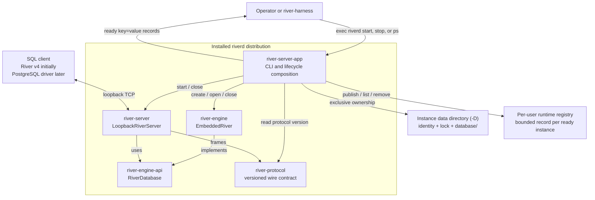
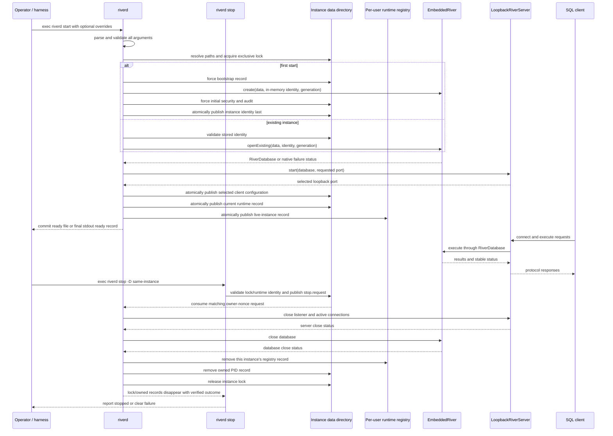

# River standalone server (`riverd`) plan

Status: Proposed; candidate for ratification by
[`ADR 0014`](../adr/0014-riverd-instance-security.md) after independent
`tic-11a5` acceptance

The ADR 0014 candidate is the single normative source during `tic-11a5` review;
implementation may rely on it only after acceptance. It prevails when this plan
summarizes a public command, status, format, security, or recovery rule. The
complete scalable audit contract is the independently accepted `tic-a221` evidence merged at
`e592addff67ac6016ae6e9e37e3bf374a6511f0d`; this plan does not define a second
audit state machine.

## 1. Objective

Provide one supported, command-line River server distribution that owns the
embedded database and loopback listener lifecycle. External tools must be able
to start River without invoking Gradle, constructing a Java classpath, naming a
Java main class, or importing River implementation packages.

The installed command is `riverd`. `riverd start` runs in the foreground and
prints its resolved paths and endpoint when ready. `riverd stop` addresses the
same data directory and publishes an owner-nonce-bound cooperative request to
the lock-owning server; the CLI never signals by PID. `riverd` and `riverd ps` list the live instances recorded by
the current user's `riverd` processes.

The first immediate consumer is `river-harness`. After `riverd` is accepted,
the harness will start the installed executable, record the child PID, wait for
the documented readiness output, and stop only that child. River-specific
build and classpath assembly will then be deleted from the harness.

## 2. Module decision

Create a production application module named `river-server-app`.
`tic-615d` creates it only when real identity, credential, filesystem, and
client-configuration production code and tests land. `tic-ec50` then configures
its Gradle application distribution to install the executable `riverd` and
wires the complete composition. The module is never empty scaffolding.

Do not place the launcher in `river-server`.

`river-server` is a reusable transport adapter. It accepts a public
`RiverDatabase`, owns listener and connection behaviour, and should remain
independent of selection and construction of the concrete embedded engine. A
command-line launcher is the composition root: it parses operator input,
selects `EmbeddedRiver`, creates or opens persistent state, starts
`LoopbackRiverServer`, formats process output, and coordinates shutdown. Adding
those responsibilities and a concrete `river-engine` dependency to
`river-server` would weaken the existing boundary.

`river-server-app` therefore has only the production dependencies it uses:

- `river-base` for stable status and database identity values;
- `river-engine` for the embedded implementation and resource-plan input;
- `river-engine-api` for the database lifecycle contract;
- `river-server` for the loopback listener;
- `river-protocol` for native protocol version/constants; and
- the aligned dependency-verified Bouncy Castle PKIX set for certificate
  construction.

The module is not speculative: its first change contains the immediate
identity/security consumer. Add it to River's production-module and
dependency-policy lists then; add application/distribution policy in
`tic-ec50` with the real command.

## 3. Component and process diagrams

### 3.1 Component boundary



The executable distribution is the public process boundary. Neither the
operator nor `river-harness` sees module JARs, Java class names, Gradle source
sets, or concrete engine objects. `river-server-app` is the only component that
knows both the concrete embedded engine and the reusable server library.

### 3.2 Start, serve, and stop sequence



Arguments and path-tree collisions are fully validated before the first
filesystem mutation. Shutdown always proceeds listener first, database second.
The stop command reads one data-directory-owned record, never searches for a
process, and never terminates or otherwise signals a PID.

## 4. Command contract

### 4.1 Commands

```text
riverd
riverd start [-D PATH|--datadir=PATH] [-L HOST:PORT|--listen=HOST:PORT]
             [--maximum-connections=N] [--ready-file=PATH]
riverd stop [-D PATH|--datadir=PATH] [--timeout=DURATION]
riverd ps
riverd audit archive [-D PATH|--datadir=PATH]
riverd credentials renew [-D PATH|--datadir=PATH]
riverd version
riverd -h
riverd --help
riverd help
riverd start -h
riverd start --help
riverd stop -h
riverd stop --help
riverd ps -h
riverd ps --help
riverd version -h
riverd version --help
riverd audit -h
riverd audit --help
riverd audit archive -h
riverd audit archive --help
riverd credentials -h
riverd credentials --help
riverd credentials renew -h
riverd credentials renew --help
riverd help start
riverd help stop
riverd help ps
riverd help version
riverd help audit
riverd help audit archive
riverd help credentials
riverd help credentials renew
```

`riverd start` and `riverd stop` are the lifecycle commands in the first
delivery. `riverd ps` is read-only. `riverd audit archive` and `riverd
credentials renew` are the two offline security recovery operations and
require exclusive ownership of a stopped instance. Invoking `riverd` without arguments is
equivalent to `riverd ps`. Do not add daemonisation, service installation,
remote administration, or database deletion.

Help behaviour:

- global and listed command/group `-h`, plus bare `riverd help`, print brief
  usage and the defaults for that exact scope;
- global and listed command/group `--help`, plus every explicitly listed
  `riverd help ...` form, print the comprehensive reference for that scope;
- help and version do not create directories or otherwise mutate state;
- any other help placement, extra token, bare group, abbreviation, combined
  short option, or syntax prints a short error plus brief usage and exits with
  status 2 before mutation.

Exit zero is `OK`; invalid syntax is exit 2 with
`INVALID_EXTERNAL_INPUT`; every operational failure is exit 1 with the exact
native `StatusCode` and stable number required by ADR 0014. Failure records go
to standard error, never accompany `riverd_status=ready`, and do not replace
native status propagation with diagnostic text.

### 4.2 Start options and defaults

```text
-D PATH, --datadir=PATH     default: $HOME/.river/default
-L HOST:PORT, --listen=HOST:PORT
                            default: 127.0.0.1:9191
--maximum-connections=N     default: 16
--ready-file=PATH           optional; no default file
```

`N` is canonical decimal `1..2147483647`. Out-of-width input is
`INVALID_EXTERNAL_INPUT`; a valid count that the one resource profile cannot
admit is `RESOURCE_EXHAUSTED` before mutation.
`DURATION` is a positive canonical decimal plus `ms`, `s`, or `m`; checked
conversion must fit a positive signed-long millisecond value. Fractional,
signed, whitespace, unitless, zero, and overflow values are invalid.

`riverd stop` accepts the same `-D PATH` or `--datadir=PATH` option and:

```text
--timeout=DURATION          default: 30s
```

Both offline recovery commands accept only the same `-D`/`--datadir` option.

The resolved instance layout is:

```text
DATADIR/
  instance.properties      launcher-owned database identity and format
  instance.lock            exclusive live-process lock
  stop.request             nonce-bound cooperative stop; normally absent
  bootstrap.properties     first-create recovery record; normally absent
  runtime.properties       bounded process, endpoint, and client-config identity
  database/                River-owned embedded database directory
  security/                owner-only generation bundles and manifest
  audit/                   active forced audit and immutable archives
```

`-D` identifies the complete River instance. The embedded engine owns the
`database/` child while `riverd` owns the small lifecycle files at the instance
root. Relative paths are resolved against the launcher's initial working
directory and printed as normalized absolute paths before readiness.

The first server supports authenticated TLS loopback only. `-L` accepts `localhost:PORT`,
`127.0.0.1:PORT`, and `[::1]:PORT`; reject wildcard, non-loopback, ambiguous,
malformed, and multi-address inputs before creating or opening anything. Port
zero requests an ephemeral port and the selected port is reported after
binding.

The server never requests elevated permissions, invokes a service manager, or
writes outside the resolved data directory except the fixed per-user runtime
registry and an explicitly supplied `--ready-file`.

`riverd` has no insecure, trust, no-authentication, or TLS-disable option and no
fallback to a plain listener. The owning OS account controls lifecycle and
credential-file access; the credential authenticates a TCP client as River's
single configured service principal. Other processes running as that account
are inside the trusted boundary. Other host accounts may reach the port but
cannot authenticate.

Every launcher persistent property record listed in ADR 0014 ends with
`record-sha256`: SHA-256 covers the exact canonical UTF-8 bytes through the LF
immediately before that final field and excludes the checksum line. Bounded
canonical read and checksum verification precede every field use. This applies
to bootstrap, instance, security, client, runtime, lock, stop request, registry,
ready file, renewal intent, and public-archive manifests; stdout is not such a
record.

The exact filesystem admission contract is ADR 0014: the resolved data tree is
POSIX owner-only with no overriding ACL/access grant. Existing owned paths are
accessed through no-follow `SecureDirectoryStream` handles. Because that API
cannot create directories, the sole path-based create is a validated fixed
component under a verified `0700` parent followed immediately by parent/child
file-key, no-follow, owner/mode/ACL, and secure-stream revalidation. The
qualified default-Linux NIO adapter supports only local `ext4`/`xfs` POSIX ACL
mask semantics. The ADR enumerates the only path calls, parent file-key
revalidation, target/source force order, destination-parent staging,
source/destination alias recovery, and both-parent forcing for a cross-parent
directory move. The adapter uses hard-link publication only for forced
immutable files and probes atomic replacement/fixed-directory moves plus file
and directory force on the same filesystem. The runtime probe is not durability
evidence: `tic-95e8` and `tic-9640` must accept an ADR-0003 qualification
artifact for the exact distribution/JDK/provider/kernel/filesystem/mount/
storage tuple before support is promoted. macOS/APFS and unrecognized/remote/
access-unprovable stores are unsupported. Unsupported proof is
`FEATURE_NOT_SUPPORTED`; wrong type/owner/mode/ACL/symlink proof is
`ACCESS_DENIED`. Before mutation, equality, unintended ancestor/descendant,
symlink, file-key, and hard-link alias collisions among the data tree, its
pairwise-disjoint fixed children, registry, and ready target are
`INVALID_EXTERNAL_INPUT`; only a fixed child's declared direct containment in
`DATADIR` is allowed. There is no
best-effort or non-POSIX mode. Version-1 property formats reject control
characters and `=` in paths; there is no encoding alternative.

### 4.3 Security bootstrap and client discovery

On first creation, `riverd` generates the exact ADR 0014 credential generation:
a raw 32-byte token, principal 1 with `SessionPermissions.ALL`, and a 365-day
self-signed X.509 v3 P-256/SHA-256 leaf with the required constraints, usages,
and three loopback SANs. It creates one local `BouncyCastleProvider` object and
passes that object to EC `KeyPairGenerator`, every content signer/converter,
`CertificateFactory`, and certificate-signature verification operation;
`tic-615d` pins and dependency-verifies one aligned Bouncy Castle set. No
global install, provider-name lookup, JDK-internal certificate class, external
`keytool`, or second DER encoder is permitted.

Generation directories hold an exact 32-byte token, bounded PKCS#8 key, and DER
certificate. A forced
`security.properties` is the credential authority and binds the instance,
generation, principal, permissions, algorithms, validity, fixed names, and
SHA-256 digests. Restart applies the ADR's no-follow type/owner/mode/size,
canonical-field, final-record SHA-256, incarnation, digest, key/certificate, signature, algorithm,
constraint, SAN, validity, principal, and permission checks before admission.
Missing or mismatched accepted material is preserved as `CORRUPTION`; a
well-formed generation outside its validity interval is `ACCESS_DENIED` on
start.
The token digest is the `TokenProof` HMAC key and is credential-equivalent;
raw token, private-key, verifier, complete security-manifest, caller scratch,
and authenticator buffers have the ADR's exact River-owned zeroing lifecycle;
JSSE state has only the specified public-session cleanup and reference clearing. The
idempotent `TokenAuthenticator` is destroyed only after workers stop and the
listener closes, public sessions are enumerated/invalidated, and River clears
its JSSE references. Only River-owned buffers and a successfully destroyed
Bouncy Castle key are guaranteed zeroed; key destroy false/throw and public
session cleanup failure are `IO_FAILURE`, while provider-owned opaque/session/
ticket erasure is not claimed.

After the listener selects its concrete port, `river-server-app` atomically
replaces and directory-forces `security/client.properties`, the exact
`riverd-client-v1` file defined by ADR 0014. It is discovery state, not restart
authority, and may be stale while stopped. `river-client` owns its only parser,
validation, pinned TLS 1.3 connector, hostname check, and credential erasure.
JDBC and CLI delegate to that owner.
The file carries incarnation, credential generation, principal, transport,
protocol, selected host/port, certificate path/digest, and token path. It never
carries a token or private key value. Advanced clients accept file paths, never
secret argv, environment, URL, readiness, registry, log, or audit values.

`riverd credentials renew -D PATH` is the only credential-validity recovery operation. It
validates the old generation except for current-time validity, archives and forces only the
prior public certificate plus redacted public manifest under the ADR's exact
content-identified name, exclusively publishes and forces `renewal.intent`
before creating its exact nonce namespace, creates and forces generation plus
one, and atomically publishes the new security authority.
It durably unlinks old secrets afterward and recovers deterministically on
either side of that authority switch. Generation overflow is
`RESOURCE_EXHAUSTED`. It has no overlap generation or implicit repair. A client
with already loaded old material is `ACCESS_DENIED`; a reload whose old secret
path is gone is `IO_FAILURE`.

On every authentication and statement admission, a wall clock earlier than
`notBefore` or at/after `notAfter` permanently closes the shared validity fence
and the listener rejects new connections. A resumed
transport still performs application authentication, and every later request
on a loaded session returns `ACCESS_DENIED`. Only work admitted before the
fence may complete or follow normal cancel/rollback. Ordered shutdown
releases listener, workers, and JSSE before destroying authentication material,
then closes the database and exits 1 `ACCESS_DENIED`; restart cannot become
ready outside the validity interval. `tic-b901` proves exactly one
`System.currentTimeMillis` and fence read per authentication/statement,
zero warmed River allocation, and matched 1/4/16-client cost evidence without
weakening the separate audit-performance gate.

### 4.4 Multiple instances

One resolved `-D` directory identifies exactly one `riverd` instance. Multiple
servers run independently by using different data directories and either
distinct ports or port zero:

```sh
riverd start -D "$HOME/.river/benchmark-a" -L 127.0.0.1:0
riverd start -D "$HOME/.river/benchmark-b" -L 127.0.0.1:0

riverd stop -D "$HOME/.river/benchmark-a"
riverd stop -D "$HOME/.river/benchmark-b"
```

Each directory has its own database, identity, lock, and PID record. A second
start against an already locked directory fails clearly without affecting the
existing server. A bind collision between different directories also fails
without stopping either instance. The selected endpoint printed by each
successful start is the source of truth when port zero is used.

`riverd stop` always identifies one data directory. There is no process scan,
implicit "most recent" instance, `stop --all`, or fallback to the default when
an explicit `-D` is invalid. With no `-D` or `--datadir`, start and stop refer
only to the default instance at `$HOME/.river/default`.

### 4.5 Process listing

Ready instances publish one bounded record beneath the fixed per-user runtime
directory `$HOME/.river/run/instances`. The record filename is a SHA-256 digest
of the normalized absolute `-D` path, so a data-directory value never becomes
an unchecked path component. Each record contains the data directory, PID,
process start instant, resolved executable, listen endpoint, River version,
and launcher-record format.

The record is published atomically after the listener is ready and before
`riverd_status=ready` is printed. If it cannot be published, startup fails and
closes the listener and database. Orderly shutdown removes only the record
whose full contents match the running instance.

`riverd ps` and a no-argument `riverd` invocation:

1. read only small regular files directly beneath the fixed registry directory;
2. validate every bounded record;
3. confirm that the PID, start instant, executable, and data directory still
   describe the recorded live process;
4. print live instances sorted by normalized data directory.

Example:

```text
PID    LISTEN           DATADIR
24102  127.0.0.1:9191   /Users/example/.river/default
24157  127.0.0.1:52144  /Users/example/.river/benchmark-a
```

The listing never scans the operating-system process table for unregistered
River processes and never signals a process. Invalid or stale records are not
reported as running; they produce a concise warning and remain available for
diagnosis. The `ps` command is otherwise side-effect free. Only a later
`start`, under the matching instance lock and after proving the exact recorded
process absent, may replace a canonical stale same-datadir record; malformed or
mismatched collisions are preserved and fail.

When there are no verified live records, exit successfully and print:

```text
No River instances are running.
Start one with:
  riverd start [-D PATH] [-L HOST:PORT]
```

### 4.6 Startup output

Successful startup prepares stable UTF-8 `key=value` records for its one
selected readiness sink:

```text
riverd_datadir=/absolute/path
riverd_data=/absolute/path/database
riverd_identity=/absolute/path/instance.properties
riverd_runtime_file=/absolute/path/runtime.properties
riverd_registry_record=/absolute/path/to/runtime/record
riverd_listen_address=127.0.0.1
riverd_listen_port=9191
riverd_pid=12345
riverd_protocol=river-v4
riverd_transport=tls-v1.3
riverd_client_config=/absolute/path/security/client.properties
riverd_server_certificate_sha256=...
riverd_status=ready
```

The exact protocol value must come from the protocol-owning module rather than
being copied into launcher code. Human diagnostics and failures go to standard
error. Paths or diagnostics that can contain line breaks or `=` must be
rejected before mutation; version 1 has no encoding alternative.

The output and ready file never contain token bytes, private-key material, or a
credential supplied by value.

When `--ready-file` is supplied, force its checksummed canonical ready-file
record and atomically publish it without overwrite only after the listener,
client configuration, runtime, and registry are ready. That publication is the
sole readiness commit; stdout afterward is a best-effort mirror, and a broken
pipe or flush failure never retracts or stops the ready service. Without a ready
file, all stdout prefix records are flushed first and the consumer's observation
of the complete final LF-terminated `riverd_status=ready` record is the sole
external commit. A fully observed record is never retracted when a later flush
fails. If target/parent/source force fails after ready-file visibility, or a
stdout-only final transfer/flush fails ambiguously after visibility, the
terminal outcome is `IO_FAILURE`: ordered cleanup runs and the process
eventually exits 1. Provably pre-commit prefix/partial-record failure performs
the ADR's exact reverse cleanup and emits no later ready record.

`riverd version` prints the exact ADR 0014 keys for River release version,
`riverd-v1`, `river-v4`, and `riverd_status=OK`. The distribution manifest is
the source of the release version; it must not inspect Git or the source
checkout at runtime. Successful stop prints only its normalized datadir,
verified PID, and `riverd_status=OK` after process exit and matching-record
removal.

### 4.7 Stop contract

After acquiring the instance lock, `riverd start` atomically writes
`runtime.properties`. The bounded record contains the PID, process start
instant, resolved `ProcessHandle` command, resolved data directory, endpoint,
client configuration, credential generation, explicit ready target or `none`,
and a random nonzero 128-bit owner nonce. The forced lock record contains the same process identity,
datadir, incarnation, and nonce. Unavailable process start/command evidence is
`FEATURE_NOT_SUPPORTED`.

`riverd stop` never signals a PID, calls `ProcessHandle.destroy`, or acquires or
steals the live lock. Before creating anything it scans pending requests,
request stages, and accepted receipts. A single matching pending or accepted
receipt is an idempotent join, including after runtime removal; only when none
exists does it match the checksummed runtime/lock identity and contended lock,
then force and atomically publish the ADR's incarnation-, runtime-checksum-, and
owner-nonce-bound `stop.request`. The lock-owning
server validates and atomically renames the request to its exact accepted
receipt before invoking the same lifecycle owner as a directly delivered
SIGINT/SIGTERM. PID/start/command are evidence and display fields only.

Exact retries and concurrent CLIs join the one valid pending/accepted request
for the same owner/runtime; contenders remove only their own unpublished
stages. A mismatched request is `NOT_OWNER`/`CORRUPTION`. Timeout atomically
removes only its unchanged unaccepted request or
loses to server acceptance; it never cancels accepted shutdown and never
escalates. Exit or PID reuse between validation and publication fails the
post-publication scan/revalidation; a matching accepted receipt joins even if
runtime is gone, while a still-pending request for a changed/absent owner is
removed by identity and returns `NOT_OWNER`. The server retains the accepted
receipt through listener/worker/JSSE/authenticator/database shutdown and
matching ready/registry/runtime removal, then removes/forces the receipt
immediately before lock release. New startup under the lock removes only
validated stale requests or receipts bound to an absent prior owner. Stop
succeeds only after the lock and all matching runtime/registry/readiness/
request/receipt records are gone.

The running process removes only its own runtime/control records during orderly shutdown.
On startup, a stale record may be replaced only after the instance lock has
been acquired and the recorded process has been proved absent. The data and
identity files are never removed by either lifecycle command.

### 4.8 Audit archive and recovery

`riverd audit archive -D PATH` succeeds only after acquiring the stopped
instance lock and proving no live owner or pending slot. It executes the
accepted `tic-a221` order: validate and force the old active generation;
create, force, and directory-force the linked new generation; publish and
force an `ARCHIVING` control record and force its control directory;
no-overwrite rename the old generation to
`audit-<generation>-sha256-<digest>.log` and force the directory; then publish
and force the next `ACTIVE` control record and force its control directory. It prints only the archive path,
SHA-256 digest, and `riverd_status=OK`. Corrupt audit remains untouched and
returns `CORRUPTION`; collision is `CONFLICT`. Retry follows the accepted
idempotent recovery matrix. There is no preserve-and-reinitialize operation.

The configured active-audit capacity must cover its declared immediate workload
with documented headroom. Startup fails before readiness when it cannot admit
at least one authentication and statement record. Runtime exhaustion returns
`RESOURCE_EXHAUSTED` before statement admission and directs the owner to the
offline archive command. Global sequence/generation/control terminal
exhaustion instead persists `EXHAUSTED`; archive cannot clear it and recovery
requires a reviewed wider format or new incarnation. Silent truncation,
overwrite, deletion, and automatic rollover are prohibited.

## 5. Persistent identity, security, and open/create behaviour

The launcher owns a small, versioned `instance.properties` file containing:

```text
format=riverd-instance-v1
database-incarnation-high=...
database-incarnation-low=...
initial-wal-generation=1
record-sha256=...
```

On the first start:

1. Parse and validate all arguments without mutation.
2. Resolve the secure parent, create or validate POSIX `0700` `DATADIR`, and
   acquire its exclusive `instance.lock` through no-follow handles.
3. Classify authority under the exact file lock. For a genuinely new tree,
   generate the incarnation/attempt nonce and replace a torn/stale lock record
   only when no authority, stage, fixed child, or other entry exists; force the
   new lock record and `DATADIR`. With an existing bootstrap/instance, use only
   its identity and require absent old-process proof. Preserve every ambiguous
   case.
4. Require a new directory or the ADR's one canonical stale
   `riverd-bootstrap-v1` record and exact
   `.riverd-bootstrap-<attempt-nonce>` namespace with no extra entries;
   otherwise preserve and return `CONFLICT`.
5. Exclusively publish and force the bootstrap record with the selected
   non-zero 128-bit incarnation and `SecureRandom` attempt nonce, then force
   `DATADIR`.
6. Build the database, initial credential generation, audit authority, and
   staged instance record under that exact namespace; force every file and
   directory required to reopen them.
7. Atomically publish `database`, `security`, then `audit` without overwrite,
   forcing `DATADIR` after each. Publish `instance.properties` last and force
   `DATADIR`; that force is the single instance-authority transition. Remove
   only checksum/file-key-matching bootstrap residue after authoritative
   validation succeeds. Retry resumes the first incomplete ordered rename;
   source/destination duplication, extra state, or identity mismatch is
   preserved as `CONFLICT`/`CORRUPTION`.

On later starts, validate the identity file strictly and call
`EmbeddedRiver.openExisting` with its recorded values. Do not infer identity
by decoding River storage formats, rewrite damaged metadata, delete partial
state, or fall back from open to create. An inconsistent data directory fails
with a clear error that names the expected state and observed path.

The exclusive lock prevents two launchers from owning one instance data
directory. Lock contention is an ordinary startup failure; `riverd` does not
inspect or kill the competing process.

An existing ready file is removed only under the acquired instance lock when a
canonical stale runtime/lock/registry record, the ready record, incarnation,
owner nonce, paths, checksums, and file keys all match and the recorded process
is proved absent. Force its external parent and each instance/registry parent
after removal. An unrelated or unverifiable ready target remains untouched and
returns `CONFLICT`/`CORRUPTION`/`NOT_OWNER`.

## 6. Runtime and shutdown

`riverd start` remains in the foreground and owns these resources in order:

1. secure directory handle and instance lock;
2. validated identity, credential, and audit authority;
3. opened `RiverDatabase`;
4. authenticated `LoopbackRiverServer`;
5. current client configuration;
6. matching runtime record;
7. matching registry record;
8. one optional ready-file or stdout readiness commitment.

Register the JVM shutdown hook only after database ownership exists. On SIGINT
or SIGTERM, close the listener first and the database second, reporting both
native `StatusCode` outcomes. The normal close path and shutdown hook must
share one idempotent lifecycle owner so each resource is closed at most once.

Startup failure closes all resources already acquired in reverse order. A
failed server close, database close, or incomplete shutdown is printed clearly
and must not be presented as a clean stop. The instance data directory and
database are never deleted automatically.

The harness records the PID returned by starting `riverd`, invokes `riverd
stop -D` against the same instance data directory, and waits for that child. It
does not need class inspection, Gradle state, or a PID search.

## 7. Resource configuration

The launcher must provide one explicit, documented development resource
profile compatible with `DatabaseResourcePlanRequest`. Keep compilation of
that request in one launcher-owned class; do not copy the TPC-C tool's numerous
resource flags into the public command.

The first CLI exposes only `--maximum-connections`. Derive the corresponding
maximum active transactions and the fixed resource profile once. Additional
memory tuning options wait for a concrete operational need and should be added
as a coherent resource profile rather than independent low-level engine knobs.

## 8. Production structure

Owned files (class names may change locally without changing their owner):

```text
river-server-app/
  build.gradle.kts
  src/main/java/io/riverdb/server/app/
    RiverDaemonMain.java        process entry and exit mapping
    RiverDaemonArguments.java   side-effect-free command decoding/help
    RiverDaemonInstance.java    create/open/start/close ownership
    RiverDaemonIdentity.java    bounded metadata read/write
    RiverDaemonCredentials.java exact credential generation/validation
    RiverDaemonFileSystem.java  POSIX/no-follow trust proof
    RiverDaemonRegistry.java    owned live-instance records and listing
    RiverDaemonOutput.java      stable startup/error records
    RiverDaemonResources.java   one resource-plan policy
  src/test/java/io/riverdb/server/app/
    ...focused tests...
```

Keep parsing, persistence, lifecycle, and rendering separate because they have
different failure boundaries. Do not introduce interfaces unless a genuine
provider boundary is needed for deterministic tests; package-private concrete
classes and injected narrow Java facilities are sufficient.

`tic-615d` owns the identity, credential, filesystem, and client-configuration
classes and the non-empty module boundary. `tic-ec50` owns the command,
lifecycle, resources, output, final runtime/registry publication formats,
application distribution, and complete caller
migration. It secures `TpccServerMain` and deletes every plain server/client
API in that same delivery. `tic-3f57` later preserves or replaces the already
authenticated benchmark launcher only after every accepted diagnostic remains
available. TPC-C diagnostics and performance capture remain in `river-bench`
and must not enter `riverd`.

`tic-b901` owns the running-validity fence and shutdown behavior together with
offline credential renewal, so neither validity boundary can diverge.

## 9. Build and distribution

Apply Gradle's `application` plugin in `river-server-app`:

```kotlin
application {
  applicationName = "riverd"
  mainClass.set("io.riverdb.server.app.RiverDaemonMain")
}
```

The supported developer build is:

```sh
./gradlew :river-server-app:installDist
river-server-app/build/install/riverd/bin/riverd --help
river-server-app/build/install/riverd/bin/riverd start
```

`assemble` must include the distribution through the normal root build. The
start scripts and distribution include one coherent dependency graph; external
consumers execute the installed script and never assemble their own classpath.

`tic-615d` adds the used identity/security module edges, settings entry,
production-module list, and dependency-policy fixtures. `tic-ec50` adds the
application/distribution/archive/reproducibility entries and removes the unused
`river-server -> river-engine` allowance while adding only used app edges. Do
not exempt the new module from existing build policy.

## 10. Test and acceptance plan

### 10.1 Focused argument tests

- brief and comprehensive help are distinct, deterministic, and side-effect
  free for every explicitly accepted global, command, group, nested-command,
  and `help ...` form; every unlisted placement/extra token is rejected;
- no arguments and `ps` produce the same deterministic listing;
- defaults resolve exactly as documented;
- `-D`/`--datadir`, `-L`/`--listen`, loopback IPv4/IPv6, explicit ports, and
  port zero parse;
- stop resolves the same default and overridden data directories as start;
- two different data directories can run concurrently on automatically
  selected ports;
- a second start against the same data directory fails on the instance lock
  without disturbing the first process;
- no live records prints the documented `riverd start` suggestion and exits
  successfully;
- non-loopback addresses, malformed ports, duplicate/conflicting options,
  control characters, `=` paths, unknown commands, and unknown options exit 2
  before filesystem mutation;
- equality, ancestor/descendant, symlink, file-key, and hard-link alias
  collisions among datadir fixed children, registry, and ready target are
  rejected before mutation.

### 10.2 Identity and ownership tests

- first start creates a bounded versioned identity atomically;
- restart reads the same incarnation and opens existing data;
- an existing ready file is never overwritten;
- missing, oversized, duplicate, malformed, or unknown-required identity
  fields fail closed;
- a non-empty unowned data directory is rejected;
- every forced write/rename/directory-force interruption in the exact
  nonce-derived bootstrap namespace resumes only a checksum/file-key-bound
  next step; missing/invalid bootstrap, source/destination duplication, or any
  extra entry is preserved;
- under-lock zero/torn/stale pre-bootstrap lock recovery is allowed only for an
  otherwise empty authority-free tree; bootstrap/instance identity and absent-
  process proofs govern every later stale lock;
- stale ready-file cleanup requires matching incarnation, owner, absent process,
  runtime/registry/path/checksum/file-key identity and parent force; unrelated
  files are preserved;
- lock contention starts no listener and kills no process;
- a ready instance publishes one bounded registry record and orderly shutdown
  removes only that matching record;
- listing ignores and warns about malformed, stale, or mismatched records
  without deleting them or signalling a process;
- cooperative stop accepts only a checksummed incarnation/runtime/owner-nonce
  request consumed by the lock-owning server and never signals a PID;
- stop covers concurrent/retry requests, timeout before/after acceptance,
  server exit and PID reuse between validation and request publication,
  prepublication pending/accepted join, late revalidation, receipt retention,
  request/accept crash residue, and never escalates or steals the lock;
- failures preserve the instance data directory for diagnosis and never delete
  data.

### 10.3 Security and audit tests

- first creation publishes a complete incarnation-bound 256-bit-token and
  pinned-certificate bundle; restart reuses the exact accepted identity;
- partial first publication before `instance.properties` authority is safely
  recoverable, while missing, oversized, mismatched, expired, symlinked, special,
  wrong-owner, or group/world-readable accepted material fails closed;
- wrong token, wrong certificate, wrong hostname, replayed proof, and omitted
  authentication admit no session or statement;
- Java CLI/JDBC and the Go harness trust only the configured instance
  certificate and erase token/proof buffers;
- all launcher properties reject checksum-invalid bytes before using any field;
- local Bouncy Castle provider-object selection covers EC key generation,
  signer, converter, certificate parse, and signature verification; global
  provider state/name lookup is absent;
- token digest/security manifest are credential-equivalent; raw token,
  private-key, verifier, caller scratch, and authenticator follow ordered
  River-owned zero/destroy on success and failure; public JSSE session
  enumeration/invalidation and reference clearing are exercised without an
  opaque/session-ticket erasure claim, and provider-key destroy false/throw is
  `IO_FAILURE`;
- readiness, registry, diagnostics, process arguments, and audit contain no
  secret values;
- audit full-at-start, runtime exhaustion, intact archive, archive collision,
  corruption preservation, terminal persistent exhaustion, every accepted
  archive interruption point, and restart after archive have focused tests;
- credential renewal covers both validity bounds, active and resumed TLS
  sessions, generation overflow, external intent before namespace creation,
  exact public-only archive and staging names,
  every pre/post-authority force/crash boundary, durable old-secret unlink,
  `ACCESS_DENIED` loaded-old versus `IO_FAILURE` missing reload, and no
  old-token overlap;
- supported and unsupported POSIX/secure-directory providers, symlink swaps,
  ACL override, every enumerated path operation, parent file-key and
  directory-create races, source/destination aliases and parent forces,
  incorrect atomic exclusive/replacement semantics, owner/mode/type failures,
  and every format framing bound have focused tests; the runtime probe is not
  accepted as durability evidence;
- a source and compiled-code check proves that production contains no plain
  listener/client fallback.

### 10.4 Real lifecycle tests

- install the real distribution, start `riverd` on port zero, parse readiness,
  connect through authenticated TLS using the published client configuration,
  execute create/insert/select, run `riverd stop`
  for the same `-D` directory, and require verified listener-then-database
  shutdown;
- restart the same data directory and read the committed row;
- start a second data directory independently to prove instance isolation;
- `riverd ps` lists both live instances with their distinct data directories
  and selected endpoints, then lists only the survivor after either is stopped;
- occupied-port and engine-open failures exit nonzero with concise errors and
  no false `riverd_status=ready` record;
- ready-file publication races with broken stdout prove file publication is
  the sole commit and a broken mirror never stops service; without a ready file,
  prefix/partial failures clean up while an externally observed complete final
  ready record remains irrevocable across a later flush failure; post-commit
  target/parent/source or ambiguous stdout-only failure terminates with
  `IO_FAILURE` after ordered cleanup;
- interrupt during startup and after readiness, verifying acquired resources
  close and the database remains restartable.

### 10.5 Build checks

Use the narrow loop while implementing:

```sh
./gradlew :river-server-app:test
./gradlew :river-server-app:installDist
./gradlew moduleDependencyPolicy
```

Then run the affected server/client tests and normal project verification
appropriate to a new distribution. Do not run builds concurrently in the
shared checkout and do not use `clean` during the edit loop.

Capture a compact slopmark baseline for `river-server`, `river-server-app`, and
the touched build files. A rising score or duplicated lifecycle/resource policy
is a signal to move ownership back to one class rather than adding wrappers.

### 10.6 Audit performance promotion

`tic-72ea` executes the exact accepted `tic-a221` correctness, fault,
allocation/copy, and matched performance plan. Fixed-count correctness runs use
1, 2, 4, and 16 clients. Five 30-second control/candidate samples per client
count use interleave `C,A,A,C,C,A,A,C,C,A` and 10,000 fixed-seed whole-sample
bootstrap resamples. Correctness, gap-free audit sequence, recovery, cleanup,
zero warmed allocation/event, zero River-owned byte-array copies, and one force
for the deterministic cohort are absolute.

At 4 and 16 clients the forces/decision upper 95% bound is at most 0.75. At all
client counts the throughput-ratio lower 95% bound is at least 0.95, while the
p99.9 latency, CPU/decision, monitor-blocked/decision, GC pause/decision, and GC
collections/million-decisions upper 95% ratio bounds are at most 1.10. A zero
control metric requires zero candidate metric. Preserve failed artifacts; no
diagnostic profile shape waives a numeric failure.

## 11. Harness migration and deletion gate

After the installed command passes its real lifecycle test:

1. Add a harness option for the `riverd` executable, defaulting to the adjacent
   River installation path when present and accepting an explicit override.
2. Start `riverd start -D <harness-owned-run-directory> -L 127.0.0.1:0` as a
   foreground child and parse the documented readiness contract.
3. Load the pinned certificate and token paths from that contract, establish
   TLS 1.3, export `EXPORTER-River-Authentication`, and complete protocol-v4
   `AUTHENTICATE` before opening a session. There is no plain fallback.
4. Record the exact executable content fingerprint and child PID in evidence.
5. Run `riverd stop -D` against the same data directory, wait for the recorded
   child, and require verified graceful shutdown.
6. Delete the harness Gradle invocation, init script, classpath parsing and
   fingerprinting, Java-main-class knowledge, and process-class inspection.
7. Migrate the standalone Go harness in this slice. `tools/tps-test.sh` and
   `tools/trace-update.sh` currently consume server-side JFR gates, resource
   controls, performance capture, deadlock/commit diagnostics, and terminal
   metrics that `riverd` deliberately does not own. Do not delete
   `TpccServerMain` before those gates move. `tic-ec50` has already secured its
   listener and removed every plain API; `tic-3f57` replaces or retains that
   authenticated diagnostic owner only after every accepted producer is
   preserved. It is not a public lifecycle or compatibility path.

The native River v4 Go transport is a separate migration boundary. It may
remain only while River explicitly owns protocol v4 as the supported client
contract. Replace it with a standard PostgreSQL-compatible Go driver when
River's PostgreSQL wire compatibility is delivered; do not mix that future
work into the launcher slice.

## 12. Completion criteria

The launcher slice is complete when:

- `riverd` runs directly from its installed distribution with no source-tree
  classpath construction;
- default and overridden paths/address are printed exactly once at startup;
- first start, clean stop, restart, connection, and persistence work through
  the real distribution;
- SIGINT/SIGTERM close the listener before the database;
- `riverd stop` stops only the server that consumes the verified owner-bound
  request, never signals by PID, and returns a clear nonzero result for stale
  or mismatched state;
- `riverd` and `riverd ps` list all verified instances registered by the
  current user, and the empty listing suggests `riverd start`;
- failed startup or shutdown exits nonzero and never prints successful
  readiness;
- the instance lock prevents concurrent ownership without inspecting or
  terminating another PID;
- help/version are useful and side-effect free;
- build dependency and reproducibility policies cover the new module;
- the harness consumes only the executable/readiness contract and all old
  River build/classpath launcher code is deleted.

## 13. Explicitly deferred

- PostgreSQL wire compatibility and a PostgreSQL Go driver;
- non-loopback listening and multi-principal SQL authorization; TLS 1.3 and
  the single incarnation-bound token are mandatory and are not deferred;
- background daemonisation, OS service installation, and privilege changes;
- remote stop/restart administration;
- automated database deletion, repair, migration, backup, or restore;
- TPC-C metrics, JFR orchestration, or benchmark-specific flags;
- a broad low-level memory-tuning CLI.
