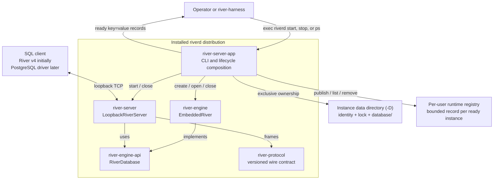
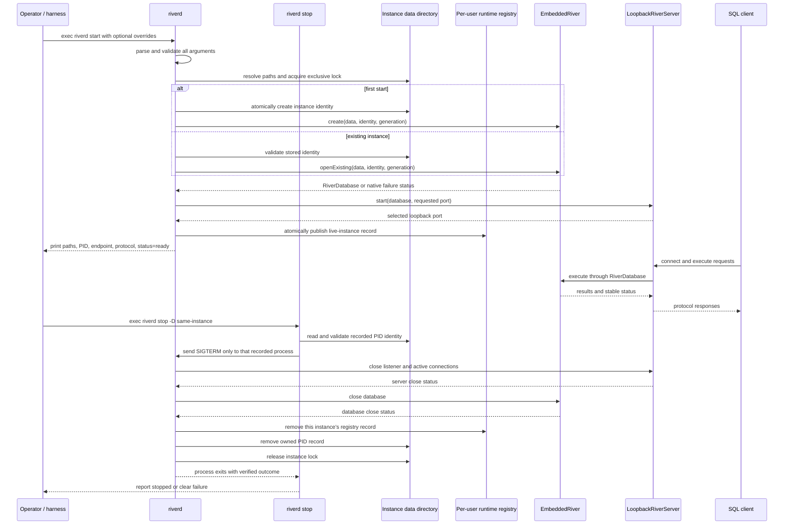

# River standalone server (`riverd`) plan

Status: proposed

## 1. Objective

Provide one supported, command-line River server distribution that owns the
embedded database and loopback listener lifecycle. External tools must be able
to start River without invoking Gradle, constructing a Java classpath, naming a
Java main class, or importing River implementation packages.

The installed command is `riverd`. `riverd start` runs in the foreground and
prints its resolved paths and endpoint when ready. `riverd stop` addresses the
same data directory and asks only the PID recorded there to shut the database
down gracefully. `riverd` and `riverd ps` list the live instances recorded by
the current user's `riverd` processes.

The first immediate consumer is `river-harness`. After `riverd` is accepted,
the harness will start the installed executable, record the child PID, wait for
the documented readiness output, and stop only that child. River-specific
build and classpath assembly will then be deleted from the harness.

## 2. Module decision

Create a production application module named `river-server-app`. Configure its
Gradle application distribution to install an executable named `riverd`.

Do not place the launcher in `river-server`.

`river-server` is a reusable transport adapter. It accepts a public
`RiverDatabase`, owns listener and connection behaviour, and should remain
independent of selection and construction of the concrete embedded engine. A
command-line launcher is the composition root: it parses operator input,
selects `EmbeddedRiver`, creates or opens persistent state, starts
`LoopbackRiverServer`, formats process output, and coordinates shutdown. Adding
those responsibilities and a concrete `river-engine` dependency to
`river-server` would weaken the existing boundary.

`river-server-app` therefore has only the production dependencies it uses:

- `river-base` for stable status and database identity values;
- `river-engine` for the embedded implementation and resource-plan input;
- `river-engine-api` for the database lifecycle contract;
- `river-server` for the loopback listener.

The module is not speculative: it contains the real command and distribution
in its first change. Add it to River's production-module and dependency-policy
lists at the same time.

## 3. Component and process diagrams

### 3.1 Component boundary



The executable distribution is the public process boundary. Neither the
operator nor `river-harness` sees module JARs, Java class names, Gradle source
sets, or concrete engine objects. `river-server-app` is the only component that
knows both the concrete embedded engine and the reusable server library.

### 3.2 Start, serve, and stop sequence



Arguments are fully validated before the first filesystem mutation. Shutdown
always proceeds listener first, database second. The stop command reads one
data-directory-owned PID record and never searches for or terminates an
unrelated PID.

## 4. Command contract

### 4.1 Commands

```text
riverd start [options]
riverd stop [options]
riverd ps
riverd audit archive [options]
riverd version
riverd help
riverd help start
riverd help stop
riverd help ps
```

`riverd start` and `riverd stop` are the lifecycle commands in the first
delivery. `riverd ps` is read-only. `riverd audit archive` is the one offline
security-audit recovery operation and requires exclusive ownership of a stopped
instance. Invoking `riverd` without arguments is
equivalent to `riverd ps`. Do not add daemonisation, service installation,
remote administration, or database deletion.

Help behaviour:

- `riverd -h` and `riverd help` print brief usage and the defaults;
- `riverd --help`, `riverd help start`, `riverd help stop`, `riverd help ps`,
  and a command's `--help` option print the relevant comprehensive reference;
- help and version do not create directories or otherwise mutate state;
- invalid syntax prints a short error plus brief usage and exits with status 2.

### 4.2 Start options and defaults

```text
-D PATH, --datadir=PATH     default: $HOME/.river/default
-L HOST:PORT, --listen=HOST:PORT
                            default: 127.0.0.1:9191
--maximum-connections=N     default: 16
--ready-file=PATH           optional; no default file
```

`riverd stop` accepts the same `-D PATH` or `--datadir=PATH` option and:

```text
--timeout=DURATION          default: 30s
```

The resolved instance layout is:

```text
DATADIR/
  instance.properties      launcher-owned database identity and format
  instance.lock            exclusive live-process lock
  runtime.properties       bounded process, endpoint, and client-config identity
  database/                River-owned embedded database directory
  security/                owner-only credential bundle and manifest
  audit/                   active forced audit and immutable archives
```

`-D` identifies the complete River instance. The embedded engine owns the
`database/` child while `riverd` owns the small lifecycle files at the instance
root. Relative paths are resolved against the launcher's initial working
directory and printed as normalized absolute paths before readiness.

The first server supports authenticated TLS loopback only. `-L` accepts `localhost:PORT`,
`127.0.0.1:PORT`, and `[::1]:PORT`; reject wildcard, non-loopback, ambiguous,
malformed, and multi-address inputs before creating or opening anything. Port
zero requests an ephemeral port and the selected port is reported after
binding.

The server never requests elevated permissions, invokes a service manager, or
writes outside the resolved data directory except the fixed per-user runtime
registry and an explicitly supplied `--ready-file`.

`riverd` has no insecure, trust, no-authentication, or TLS-disable option and no
fallback to a plain listener. The owning OS account controls lifecycle and
credential-file access; the credential authenticates a TCP client as River's
single configured service principal. Other processes running as that account
are inside the trusted boundary. Other host accounts may reach the port but
cannot authenticate.

### 4.3 Security bootstrap and client discovery

On first creation, `riverd` generates a raw 32-byte token and a self-signed
instance TLS leaf with P-256/SHA-256, `CA=false`, `serverAuth`, digital-signature
usage, and SANs for `localhost`, `127.0.0.1`, and `::1`. The `security`
directory and private components are owner-only. Credential files are
exclusively staged, forced, atomically renamed, and directory-forced; the
bounded `security.properties` manifest is published last and binds the bundle
to the database incarnation, credential generation, algorithms, principal,
permission mask, validity, and certificate SHA-256.

Restart validates regular-file type, no-symlink status, owner, permissions,
size, manifest fields, incarnation, certificate digest, hostname coverage, and
validity before opening the listener. Once the manifest or database identity is
authoritative, missing or mismatched material fails closed and is never
regenerated implicitly. A platform on which owner-only access cannot be proved
is unsupported for `riverd`.

The runtime record identifies the selected endpoint, PID/start identity,
transport `tls-v1.3`, certificate fingerprint, and the owner-only bounded client
configuration. `river sql -D PATH` consumes that configuration automatically.
Advanced clients accept certificate-file and token-file paths, never secret
values in arguments, environment variables, URLs, readiness, registry, logs,
or audit.

The certificate-expiry recovery operation replaces the complete validated
bundle only while the instance is stopped and exclusively locked, preserves
the prior public certificate and manifest under a content-identified archive,
and increments the credential generation. It never repairs partial or corrupt
material implicitly.

### 4.4 Multiple instances

One resolved `-D` directory identifies exactly one `riverd` instance. Multiple
servers run independently by using different data directories and either
distinct ports or port zero:

```sh
riverd start -D "$HOME/.river/benchmark-a" -L 127.0.0.1:0
riverd start -D "$HOME/.river/benchmark-b" -L 127.0.0.1:0

riverd stop -D "$HOME/.river/benchmark-a"
riverd stop -D "$HOME/.river/benchmark-b"
```

Each directory has its own database, identity, lock, and PID record. A second
start against an already locked directory fails clearly without affecting the
existing server. A bind collision between different directories also fails
without stopping either instance. The selected endpoint printed by each
successful start is the source of truth when port zero is used.

`riverd stop` always identifies one data directory. There is no process scan,
implicit "most recent" instance, `stop --all`, or fallback to the default when
an explicit `-D` is invalid. With no `-D` or `--datadir`, start and stop refer
only to the default instance at `$HOME/.river/default`.

### 4.5 Process listing

Ready instances publish one bounded record beneath the fixed per-user runtime
directory `$HOME/.river/run/instances`. The record filename is a SHA-256 digest
of the normalized absolute `-D` path, so a data-directory value never becomes
an unchecked path component. Each record contains the data directory, PID,
process start instant, resolved executable, listen endpoint, River version,
and launcher-record format.

The record is published atomically after the listener is ready and before
`riverd_status=ready` is printed. If it cannot be published, startup fails and
closes the listener and database. Orderly shutdown removes only the record
whose full contents match the running instance.

`riverd ps` and a no-argument `riverd` invocation:

1. read only small regular files directly beneath the fixed registry directory;
2. validate every bounded record;
3. confirm that the PID, start instant, executable, and data directory still
   describe the recorded live process;
4. print live instances sorted by normalized data directory.

Example:

```text
PID    LISTEN           DATADIR
24102  127.0.0.1:9191   /Users/example/.river/default
24157  127.0.0.1:52144  /Users/example/.river/benchmark-a
```

The listing never scans the operating-system process table for unregistered
River processes and never signals a process. Invalid or stale records are not
reported as running; they produce a concise warning and remain available for
diagnosis. The `ps` command is otherwise side-effect free.

When there are no verified live records, exit successfully and print:

```text
No River instances are running.
Start one with:
  riverd start [-D PATH] [-L HOST:PORT]
```

### 4.6 Startup output

Successful startup writes stable UTF-8 `key=value` records to standard output
and flushes them before accepting readiness:

```text
riverd_datadir=/absolute/path
riverd_data=/absolute/path/database
riverd_identity=/absolute/path/instance.properties
riverd_runtime_file=/absolute/path/runtime.properties
riverd_registry_record=/absolute/path/to/runtime/record
riverd_listen_address=127.0.0.1
riverd_listen_port=9191
riverd_pid=12345
riverd_protocol=river-v4
riverd_transport=tls-v1.3
riverd_client_config=/absolute/path/security/client.properties
riverd_server_certificate_sha256=...
riverd_status=ready
```

The exact protocol value must come from the protocol-owning module rather than
being copied into launcher code. Human diagnostics and failures go to standard
error. Paths or diagnostics that can contain line breaks or `=` must be
rejected or encoded before emission; the initial implementation should prefer
rejecting control characters.

The output and ready file never contain token bytes, private-key material, or a
credential supplied by value.

When `--ready-file` is supplied, publish the same bounded records atomically
only after the listener is ready. Refuse to overwrite an existing file. The
stdout records remain mandatory so direct users can see the resolved
configuration without opening another file.

`riverd version` prints the River release version, launcher contract version,
and native protocol version. The distribution manifest is the source of the
release version; it must not inspect Git or the source checkout at runtime.

### 4.7 Stop contract

After acquiring the instance lock, `riverd start` atomically writes
`runtime.properties`. The bounded record contains the PID, process start instant,
resolved executable, and resolved data directory. These values are all known to
the launcher; no process search or Java-class inspection is involved.

`riverd stop` reads that one record and verifies the live process PID, start
instant, executable, and data directory before sending SIGTERM. A missing,
malformed, stale, reused, or mismatched PID record produces a clear nonzero
error and sends no signal. The command waits up to `--timeout` for the process
to exit and the PID record to disappear. Timeout is an error; the first
delivery does not escalate automatically to SIGKILL.

The running process removes only its own runtime record during orderly shutdown.
On startup, a stale record may be replaced only after the instance lock has
been acquired and the recorded process has been proved absent. The data and
identity files are never removed by either lifecycle command.

### 4.8 Audit archive and recovery

`riverd audit archive -D PATH` succeeds only after acquiring the instance lock
and proving no live owner. It validates the complete active audit, forces and
atomically renames it to a content-identified name that is never overwritten,
creates and forces a new empty active audit, and prints the archive path and
digest. Corrupt audit remains untouched and returns `CORRUPTION`; recovery then
requires restoring a known-good audit or a separately reviewed explicit
preserve-and-reinitialize operation.

The configured active-audit capacity must cover the immediate harness workload
with documented headroom. Startup fails before readiness when it cannot admit
at least one authentication and statement record. Runtime exhaustion returns
`RESOURCE_EXHAUSTED` before statement admission and directs the owner to the
offline archive command. Silent truncation, overwrite, deletion, and automatic
rollover are prohibited.

## 5. Persistent identity, security, and open/create behaviour

The launcher owns a small, versioned `instance.properties` file containing:

```text
format=riverd-instance-v1
database-incarnation-high=...
database-incarnation-low=...
initial-wal-generation=1
```

On the first start:

1. Parse and validate all arguments without mutation.
2. Create the instance data directory and acquire an exclusive `instance.lock`.
3. Require a new `database` directory or a launcher identity that already owns
   it; never adopt an arbitrary non-empty directory.
4. Generate a non-zero 128-bit database incarnation with `SecureRandom`.
5. Atomically publish the bounded identity file with owner-only permissions
   where the platform supports them.
6. Create the database using that exact identity and WAL generation.

On later starts, validate the identity file strictly and call
`EmbeddedRiver.openExisting` with its recorded values. Do not infer identity
by decoding River storage formats, rewrite damaged metadata, delete partial
state, or fall back from open to create. An inconsistent data directory fails
with a clear error that names the expected state and observed path.

The exclusive lock prevents two launchers from owning one instance data
directory. Lock contention is an ordinary startup failure; `riverd` does not
inspect or kill the competing process.

## 6. Runtime and shutdown

`riverd start` remains in the foreground and owns these resources in order:

1. instance lock;
2. opened `RiverDatabase`;
3. `LoopbackRiverServer`.

Register the JVM shutdown hook only after database ownership exists. On SIGINT
or SIGTERM, close the listener first and the database second, reporting both
native `StatusCode` outcomes. The normal close path and shutdown hook must
share one idempotent lifecycle owner so each resource is closed at most once.

Startup failure closes all resources already acquired in reverse order. A
failed server close, database close, or incomplete shutdown is printed clearly
and must not be presented as a clean stop. The instance data directory and
database are never deleted automatically.

The harness records the PID returned by starting `riverd`, invokes `riverd
stop -D` against the same instance data directory, and waits for that child. It
does not need class inspection, Gradle state, or a PID search.

## 7. Resource configuration

The launcher must provide one explicit, documented development resource
profile compatible with `DatabaseResourcePlanRequest`. Keep compilation of
that request in one launcher-owned class; do not copy the TPC-C tool's numerous
resource flags into the public command.

The first CLI exposes only `--maximum-connections`. Derive the corresponding
maximum active transactions and the fixed resource profile once. Additional
memory tuning options wait for a concrete operational need and should be added
as a coherent resource profile rather than independent low-level engine knobs.

## 8. Production structure

Suggested files:

```text
river-server-app/
  build.gradle.kts
  src/main/java/io/riverdb/server/app/
    RiverDaemonMain.java        process entry and exit mapping
    RiverDaemonArguments.java   side-effect-free command decoding/help
    RiverDaemonInstance.java    create/open/start/close ownership
    RiverDaemonIdentity.java    bounded metadata read/write
    RiverDaemonRegistry.java    owned live-instance records and listing
    RiverDaemonOutput.java      stable startup/error records
    RiverDaemonResources.java   one resource-plan policy
  src/test/java/io/riverdb/server/app/
    ...focused tests...
```

Keep parsing, persistence, lifecycle, and rendering separate because they have
different failure boundaries. Do not introduce interfaces unless a genuine
provider boundary is needed for deterministic tests; package-private concrete
classes and injected narrow Java facilities are sufficient.

Once `riverd` is the owner, move only generally useful lifecycle logic out of
`TpccServerMain`; delete that benchmark launcher when River-owned callers have
migrated. TPC-C diagnostics and performance capture remain in `river-bench`
and must not enter `riverd`.

## 9. Build and distribution

Apply Gradle's `application` plugin in `river-server-app`:

```kotlin
application {
  applicationName = "riverd"
  mainClass.set("io.riverdb.server.app.RiverDaemonMain")
}
```

The supported developer build is:

```sh
./gradlew :river-server-app:installDist
river-server-app/build/install/riverd/bin/riverd --help
river-server-app/build/install/riverd/bin/riverd start
```

`assemble` must include the distribution through the normal root build. The
start scripts and distribution include one coherent dependency graph; external
consumers execute the installed script and never assemble their own classpath.

Update the root dependency allowlist, declared-dependency map, production
module list, settings, archive/reproducibility coverage, and any module-policy
fixtures in the same change. Do not exempt the new module from existing build
policy.

## 10. Test and acceptance plan

### 10.1 Focused argument tests

- brief and comprehensive help are distinct, deterministic, and side-effect
  free;
- no arguments and `ps` produce the same deterministic listing;
- defaults resolve exactly as documented;
- `-D`/`--datadir`, `-L`/`--listen`, loopback IPv4/IPv6, explicit ports, and
  port zero parse;
- stop resolves the same default and overridden data directories as start;
- two different data directories can run concurrently on automatically
  selected ports;
- a second start against the same data directory fails on the instance lock
  without disturbing the first process;
- no live records prints the documented `riverd start` suggestion and exits
  successfully;
- non-loopback addresses, malformed ports, duplicate/conflicting options,
  control characters, unknown commands, and unknown options exit 2 before
  filesystem mutation.

### 10.2 Identity and ownership tests

- first start creates a bounded versioned identity atomically;
- restart reads the same incarnation and opens existing data;
- an existing ready file is never overwritten;
- missing, oversized, duplicate, malformed, or unknown-required identity
  fields fail closed;
- a non-empty unowned data directory is rejected;
- lock contention starts no listener and kills no process;
- a ready instance publishes one bounded registry record and orderly shutdown
  removes only that matching record;
- listing ignores and warns about malformed, stale, or mismatched records
  without deleting them or signalling a process;
- stop signals the exact recorded live process and rejects a missing,
  malformed, stale, reused, or mismatched PID record without signalling;
- stop timeout returns nonzero and does not escalate to SIGKILL;
- failures preserve the instance data directory for diagnosis and never delete
  data.

### 10.3 Security and audit tests

- first creation publishes a complete incarnation-bound 256-bit-token and
  pinned-certificate bundle; restart reuses the exact accepted identity;
- partial publication before the authoritative manifest is safely recoverable,
  while missing, oversized, mismatched, expired, symlinked, special,
  wrong-owner, or group/world-readable accepted material fails closed;
- wrong token, wrong certificate, wrong hostname, replayed proof, and omitted
  authentication admit no session or statement;
- Java CLI/JDBC and the Go harness trust only the configured instance
  certificate and erase token/proof buffers;
- readiness, registry, diagnostics, process arguments, and audit contain no
  secret values;
- audit full-at-start, runtime exhaustion, intact archive, archive collision,
  corruption preservation, and restart after archive have focused tests;
- a source and compiled-code check proves that production contains no plain
  listener/client fallback.

### 10.4 Real lifecycle tests

- install the real distribution, start `riverd` on port zero, parse readiness,
  connect through authenticated TLS using the published client configuration,
  execute create/insert/select, run `riverd stop`
  for the same `-D` directory, and require verified listener-then-database
  shutdown;
- restart the same data directory and read the committed row;
- start a second data directory independently to prove instance isolation;
- `riverd ps` lists both live instances with their distinct data directories
  and selected endpoints, then lists only the survivor after either is stopped;
- occupied-port and engine-open failures exit nonzero with concise errors and
  no false `riverd_status=ready` record;
- interrupt during startup and after readiness, verifying acquired resources
  close and the database remains restartable.

### 10.5 Build checks

Use the narrow loop while implementing:

```sh
./gradlew :river-server-app:test
./gradlew :river-server-app:installDist
./gradlew moduleDependencyPolicy
```

Then run the affected server/client tests and normal project verification
appropriate to a new distribution. Do not run builds concurrently in the
shared checkout and do not use `clean` during the edit loop.

Capture a compact slopmark baseline for `river-server`, `river-server-app`, and
the touched build files. A rising score or duplicated lifecycle/resource policy
is a signal to move ownership back to one class rather than adding wrappers.

## 11. Harness migration and deletion gate

After the installed command passes its real lifecycle test:

1. Add a harness option for the `riverd` executable, defaulting to the adjacent
   River installation path when present and accepting an explicit override.
2. Start `riverd start -D <harness-owned-run-directory> -L 127.0.0.1:0` as a
   foreground child and parse the documented readiness contract.
3. Load the pinned certificate and token paths from that contract, establish
   TLS 1.3, export `EXPORTER-River-Authentication`, and complete protocol-v4
   `AUTHENTICATE` before opening a session. There is no plain fallback.
4. Record the exact executable content fingerprint and child PID in evidence.
5. Run `riverd stop -D` against the same data directory, wait for the recorded
   child, and require verified graceful shutdown.
6. Delete the harness Gradle invocation, init script, classpath parsing and
   fingerprinting, Java-main-class knowledge, and process-class inspection.
7. Migrate only callers whose accepted evidence can be reproduced. The
   standalone Go harness moves in this slice. `tools/tps-test.sh` and
   `tools/trace-update.sh` currently consume server-side JFR gates, resource
   controls, performance capture, deadlock/commit diagnostics, and terminal
   metrics that `riverd` deliberately does not own. Do not delete
   `TpccServerMain` or pretend those gates survived until a named generic
   diagnostics boundary or a narrow benchmark orchestrator replaces every
   accepted evidence producer. While it remains, secure its listener with the
   same TLS/authentication boundary; it is not an unauthenticated compatibility
   path.

The native River v4 Go transport is a separate migration boundary. It may
remain only while River explicitly owns protocol v4 as the supported client
contract. Replace it with a standard PostgreSQL-compatible Go driver when
River's PostgreSQL wire compatibility is delivered; do not mix that future
work into the launcher slice.

## 12. Completion criteria

The launcher slice is complete when:

- `riverd` runs directly from its installed distribution with no source-tree
  classpath construction;
- default and overridden paths/address are printed exactly once at startup;
- first start, clean stop, restart, connection, and persistence work through
  the real distribution;
- SIGINT/SIGTERM close the listener before the database;
- `riverd stop` stops only the verified PID recorded by that instance and
  returns a clear nonzero result for stale or mismatched state;
- `riverd` and `riverd ps` list all verified instances registered by the
  current user, and the empty listing suggests `riverd start`;
- failed startup or shutdown exits nonzero and never prints successful
  readiness;
- the instance lock prevents concurrent ownership without inspecting or
  terminating another PID;
- help/version are useful and side-effect free;
- build dependency and reproducibility policies cover the new module;
- the harness consumes only the executable/readiness contract and all old
  River build/classpath launcher code is deleted.

## 13. Explicitly deferred

- PostgreSQL wire compatibility and a PostgreSQL Go driver;
- non-loopback listening, TLS, tokens, and multi-principal authorization;
- background daemonisation, OS service installation, and privilege changes;
- remote stop/restart administration;
- automated database deletion, repair, migration, backup, or restore;
- TPC-C metrics, JFR orchestration, or benchmark-specific flags;
- a broad low-level memory-tuning CLI.
